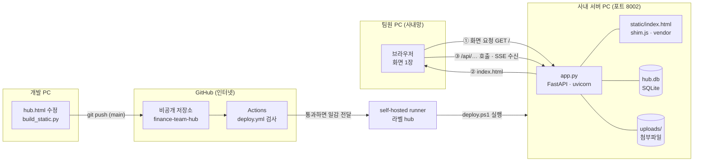
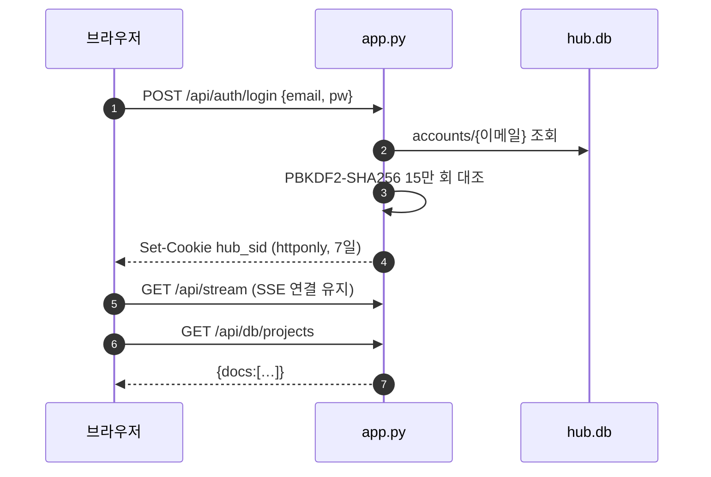
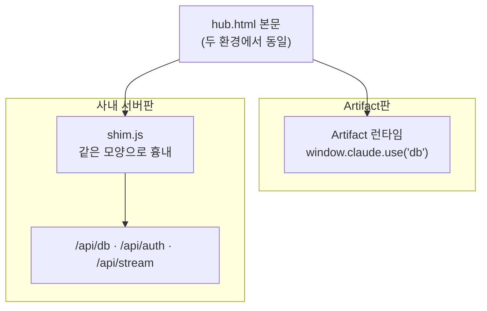

# 아키텍처 개요

이 페이지는 "허브가 어떤 부품으로 이루어져 있고, 팀원이 화면을 열었을 때 무엇이 어디로 오가는가"에 답합니다. 부품은 화면 파일 한 개, 서버 프로그램 한 개, 데이터 파일 한 개로 끝납니다.

## 전체 구성

읽는 법: 팀원은 사내망에서 서버 PC의 8002 포트로 접속합니다. 서버가 화면 파일을 내려주고, 그다음부터 화면은 `/api/…` 주소로만 서버와 대화합니다. 데이터는 `hub.db` 한 파일에 전부 들어 있고 첨부파일만 `uploads/` 폴더에 따로 있습니다. 코드는 GitHub 비공개 저장소에 있고, 개발 PC에서 push하면 서버 PC 안에서 대기 중인 러너가 받아 자동 반영합니다. **데이터는 GitHub에 올라가지 않습니다.**

## 부품별 역할

| 부품 | 위치 | 하는 일 |
|---|---|---|
| 화면 | `hub.html` (저장소 루트) | 사용자가 보는 전부. 화면 4개, 편집 창, 권한별 버튼 표시, 엑셀 파서, 실시간 갱신 구독 |
| 서버 | `server/app.py` | 로그인·세션, 문서 저장소 API, 권한·승인 규칙 재검사, SSE 알림, 엑셀 생성, 첨부파일, 감사·수정 이력, 기동 시 데이터 변환 |
| 연결 층 | `server/static/shim.js` | 화면이 쓰는 저장소·로그인 인터페이스를 서버 API 호출로 바꿔 주는 어댑터 |
| 데이터 | `server/hub.db` · `server/uploads/` | SQLite 파일 한 개(과제·일정·계정·링크·설정 전부) + 첨부파일 폴더 |

빌드(`server/build_static.py`)와 배포(`server/deploy.ps1`, `.github/workflows/`)를 포함한 전체 파일 목록은 [모듈 맵](modules.md)에 있습니다.

## 요청이 흐르는 길

### 1. 화면 받기

`GET /` 는 `server/static/index.html` 을 no-cache로 내려줍니다. 이 파일 하나에 화면 코드가 전부 들어 있어 추가 요청이 거의 없습니다(SheetJS와 `shim.js`만 별도). 파일은 로그인 여부와 무관하게 내려가고, 로그인 검사는 화면 안의 로그인 게이트가 합니다.

### 2. 로그인과 세션

- 세션 토큰은 `sessions` 표에 저장하고 브라우저에는 httponly 쿠키 `hub_sid`(7일)로만 내보냅니다. 화면 JavaScript가 토큰을 읽을 수 없습니다. 새로고침 때는 `GET /api/auth/me` 로 세션을 복원합니다.
- 없는 계정으로 로그인해도 가짜 해시를 같은 횟수로 계산해 응답 시간을 맞춥니다(계정이 있는지 없는지 시간으로 알아낼 수 없게).
- `/api` 경로는 `health` · `admins` · `login` · `signup` 을 뺀 전부가 로그인 필요입니다.

### 3. 데이터 읽고 쓰기

화면은 저장소를 직접 다루지 않고 컬렉션·문서 단위로만 다룹니다. 읽기·구독은 `GET /api/db/{coll}` 과 `GET /api/db/{coll}/{id}`, 쓰기는 `POST`(새로 만들기) · `PUT`(전체 교체) · `PATCH`(일부 항목만) · `DELETE`, 동시 편집 방지는 `POST` · `DELETE /api/lock/{key}` 입니다. 전체 목록은 [API](api.md)에 있습니다.

저장·삭제 때 서버는 화면이 보낸 값을 믿지 않고 권한·승인 규칙을 **다시** 검사합니다. 화면이 버튼을 숨기는 것은 편의일 뿐이고 최종 판정은 서버가 합니다. 저장·삭제는 `audit` 표에, 과제 내용 변경은 `history` 표에 남습니다.

### 4. 실시간 반영 (SSE)

서버는 저장·삭제가 일어나면 SSE(Server-Sent Events, 서버가 브라우저 쪽으로 한 방향으로 알림을 밀어 주는 표준 방식)로 "어느 컬렉션의 어느 문서가 바뀌었다"만 알립니다. 알림을 받은 `shim.js` 가 그 컬렉션을 다시 읽고 화면을 새로 그립니다. 그래서 옆자리 팀원이 저장하면 내 화면이 새로고침 없이 바뀝니다.

연결이 끊기면 브라우저의 `EventSource` 가 스스로 재접속하고, 성공하면 구독 중인 컬렉션 전체를 다시 읽어 그동안의 변경을 메웁니다. 로그아웃 상태에서는 계속 401로 재시도하지 않도록 연결을 닫아 둡니다. 화면 오른쪽 위의 "팀 공용 저장소 연결됨" 표시가 이 연결 상태입니다.

## 화면 한 파일의 내부 구조

`hub.html` 은 약 210KB 한 파일에 스타일·마크업·스크립트가 모두 들어 있습니다. 위에서 아래로 이런 순서입니다.

| 층 | 내용 |
|---|---|
| 스타일 | CSS 변수(색·간격·그림자) 토큰 정의 후 컴포넌트 규칙. 자세히는 [디자인 시스템](design-system.md) |
| 마크업 | 화면 4개 — `#view-home`(메인) · `#view-projects`(프로젝트) · `#view-calendar`(일정) · `#view-accounts`(계정 관리, 관리자 전용) + 편집·상세 모달 |
| 상수 | `FIELDS`(입력 항목 정의), `AREAS`(업무 영역 6), `STATUS_VIEW`(상태 4), `FREQS` · `TIME_CYCLES` · `COST_CYCLES`(효과 지표 선택지), `SERVERS`, `SCOPES`, `EVTYPES`(일정 유형 5), `XL_HEAD`(엑셀 머리글 매핑), `STATUS_ALIAS` · `AREA_ALIAS`(옛 표기 호환) |
| 상태 | `projects` · `events` · `links` · `people` 배열을 메모리에 두고, 저장소 구독(`onSnapshot`)으로 갱신되면 다시 그림 |
| 렌더링 | `renderHome()` · `renderProjects()` · `renderEvents()` · `renderCalendar()` · `renderAccounts()` |
| 권한 판정 | `isAdmin` · `canEdit` · `isOwner` · `isApproved` · `freeEdit` — 버튼 표시와 저장 경로가 여기서 갈림. 같은 규칙을 서버가 다시 검사 |
| AUTH 층 | `const AUTH = window.HUB_AUTH \|\| ARTIFACT_AUTH;` — 로그인 호출을 한 군데로 모아 둔 자리 |

입력 폼은 손으로 만들지 않고 `FIELDS` 배열(키 · 라벨 · 필수 여부 · 절 · 형식 · 선택지)에서 자동 생성합니다. 그래서 항목을 하나 늘리려면 `FIELDS` 에 한 줄 추가하고, 필요하면 엑셀 머리글 매핑과 현황 양식에 같이 반영하면 됩니다. 자세한 규칙은 [프론트엔드 아키텍처](frontend.md)에 있습니다.

!!! warning "브라우저 기본 확인창을 쓰지 않습니다"
    `confirm()` · `prompt()` · `alert()` 대신 자체 대화상자 `ask()` 만 씁니다. Artifact 샌드박스에서 기본 확인창이 즉시 `false` 를 돌려주어 삭제·승인 버튼이 무반응이었던 이력 때문입니다.

## 연결 층(shim.js)이 하는 일

허브는 원래 claude.ai Artifact로 만들었고, 그때 화면은 Artifact 런타임이 주는 저장소 인터페이스 `window.claude.use("db")` 를 통해 데이터를 다뤘습니다. 사내 서버판으로 옮길 때 **화면 코드를 고치지 않기 위해**, 같은 모양의 객체를 흉내 내어 사내 서버 API로 잇는 얇은 층을 하나 넣었습니다. 그게 `server/static/shim.js` 입니다.

- `shim.js` 는 `window.claude` 가 이미 있으면(= 진짜 Artifact 안이면) 아무 일도 하지 않고 즉시 빠집니다. 첫 줄이 `if (window.claude && window.claude.use) return;` 입니다.
- 서버판에서는 `window.claude = { use: … }` 를 직접 만들어 넣습니다. `db` 를 요청하면 `doc()` · `collection()` · `add()` · `set()` · `update()` · `delete()` · `onSnapshot()` · `where()` · `acquire()` 를 가진 객체를, `downloads` 를 요청하면 브라우저 내려받기를 하는 객체를 돌려줍니다. 구독은 컬렉션별 캐시와 구독자 집합을 두고, SSE 알림이 오면 그 컬렉션만 다시 읽어 전달합니다.
- 로그인은 `window.HUB_AUTH` 를 채워 넣어 화면의 `AUTH` 자리에 끼워 넣습니다. 화면은 `AUTH.login()` 만 부르고, 그게 Artifact 쪽 구현인지 서버 API 호출인지는 모릅니다.
- 마지막으로 `window.HUB_SERVER_MODE = true` 를 세웁니다. 첨부파일 업로드·서버 엑셀 내보내기처럼 **서버판에만 있는 기능**은 화면이 이 깃발을 보고 버튼을 켭니다.

결과적으로 `hub.html` 은 한 벌이고 Artifact판과 서버판이 같은 소스를 씁니다. 화면을 고칠 때 두 곳을 따로 손댈 필요가 없습니다. 이 결정의 배경은 [ADR-0002](adr/0002-single-frontend-with-adapter.md)에 정리해 두었습니다.

!!! note "Artifact판은 폐기 방향입니다"
    Artifact판은 팀원 계정의 조직 불일치로 접속이 막히는 문제가 있어 사내 서버판으로 전환했습니다(자세히는 [ADR-0001](adr/0001-artifact-to-onprem.md)). 소스를 공유하는 구조는 그대로 두었지만, 운영은 사내 서버판만 합니다.

## 데이터가 놓이는 자리

`hub.db` 와 `uploads/` 는 저장소(git)에 올리지 않고 배포 복사에서도 제외해, 코드를 갱신해도 그대로 보존됩니다. 각각 하루 한 번 자동 백업합니다. 반대로 `server/*.py` 와 `server/static/` 은 배포 때마다 덧쓰입니다.

표 구조와 필드 정의는 [데이터 모델·스키마](data-model.md)에, 백업·복구 절차는 [서버 PC 운영](operations.md)에 있습니다.

## 옮길 때(이관)

`server` 폴더와 `hub.db` · `uploads` 를 그대로 복사해 같은 명령으로 실행하면 되고, 바뀌는 것은 접속 주소뿐입니다. 컨테이너 환경이라면 Python 3.12 이미지에 `server/requirements.txt` 를 설치해 uvicorn으로 띄우고 데이터는 볼륨으로 붙입니다. Azure 이관 때는 로그인 방식이 회사 MS 계정으로 바뀔 예정이라 [인증](auth.md) 층이 교체 대상입니다.

---

**관련 문서**

- [모듈 맵](modules.md)
- [배포](deployment.md)
- [데이터 모델·스키마](data-model.md)
- [프론트엔드 아키텍처](frontend.md)
