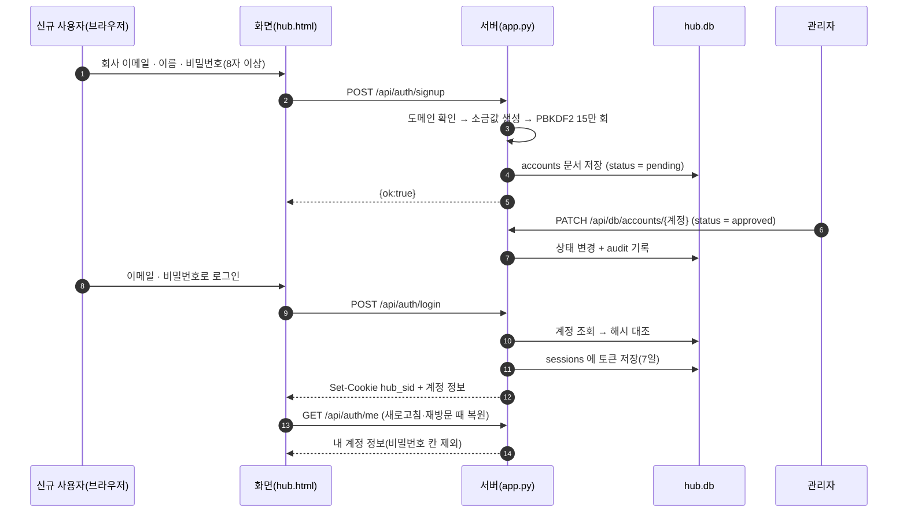

# 인증 (로그인·가입·승인)

누가 허브에 들어올 수 있고, 로그인 상태가 어떻게 유지되며, 비밀번호를 잊었을 때 어떻게 되는지 답하는 페이지입니다.
계정은 회사 이메일로 직접 신청하고, 관리자가 승인해야 로그인할 수 있습니다.

## 1. 구현이 둘, 인터페이스는 하나

화면(`hub.html`)은 로그인 관련 동작을 `AUTH` 하나로만 호출합니다. 그 `AUTH` 자리에 어떤 구현이 들어가는지가 환경에 따라 다릅니다.

| 구현 | 어디에 | 검증하는 곳 |
|---|---|---|
| `ARTIFACT_AUTH` | `hub.html` 안 | 브라우저. 계정 문서의 해시를 내려받아 입력한 비밀번호의 해시와 대조 |
| `HUB_AUTH` | `server/static/shim.js` | 사내 서버. `/api/auth/…` 를 호출하고 서버가 대조 |

```js
const AUTH = window.HUB_AUTH || ARTIFACT_AUTH;
```

`shim.js`가 먼저 실행되어 `window.HUB_AUTH`를 넣어 두면 서버판, 없으면 Artifact판입니다.
두 구현은 같은 메서드(`admins`, `restore`, `login`, `signup`, `logout`, `changePw`, `resetPw`)와 같은 반환 모양을 갖습니다.
해시 방식도 같은 **PBKDF2-SHA256 15만 회**라서, Artifact판에서 쓰던 비밀번호를 서버판에서 그대로 쓸 수 있습니다. → [ADR-0002](adr/0002-single-frontend-with-adapter.md)

!!! warning "서버판에서 하는 검증이 최종 판정입니다"
    Artifact판에서는 브라우저가 대조하므로, 화면 코드를 신뢰할 수 있는 환경(사내 서버판)에서만 진짜 검증이 이루어집니다.
    서버판은 로그인·가입·비밀번호를 모두 서버에서 처리하고, 저장·삭제 권한도 서버가 다시 검사합니다. → [역할·권한](rbac.md)

## 2. 가입 → 승인 → 로그인



### 2.1 가입 신청

- **회사 도메인 2개만** 받습니다(장금상선·흥아라인). 서버 상수 `ALLOWED_DOMAINS`에 도메인과 회사 이름이 짝지어 있어서, 가입하면 회사 칸이 자동으로 채워집니다.
- 비밀번호는 8자 이상입니다. 계정마다 새 소금값(16바이트)을 만들어 해시를 저장하고, 원문은 어디에도 남기지 않습니다.
- 새 계정은 `status = pending`, `role = member`로 시작합니다. 단, `meta/approvers` 명단에 미리 올라 있던 계정이면 `role = admin`으로 시작하고 그 명단에서 빠집니다.
- 실패 응답은 코드로 구분합니다: `email`(도메인 불일치) · `name`(이름 없음) · `pw`(8자 미만) · `exists`(이미 있는 계정) · `exists_pending`(신청했지만 아직 승인 전).

### 2.2 관리자 승인

관리자가 계정 관리 탭에서 승인하면 `status`가 `approved`가 되고 그때부터 로그인이 됩니다.
승인 전에 로그인하면 '승인 대기 중' 안내가 나옵니다. 거절(`rejected`)·비활성(`disabled`) 계정은 로그인이 막힙니다.

### 2.3 로그인

| 상황 | 응답 |
|---|---|
| 성공 | `{ok:true, account}` + 세션 쿠키. 계정 문서의 `lastLoginAt`이 갱신됩니다 |
| 이메일 형식·도메인이 아님, 비밀번호 빈칸 | `{ok:false, code:"bad"}` |
| 계정이 없거나 비밀번호가 틀림 | `{ok:false, code:"bad"}` (구분하지 않습니다) |
| 승인 대기(`pending`·`verified`) | `{ok:false, code:"pending"}` |
| 그 밖의 상태(거절·비활성) | `{ok:false, code:"blocked"}` |

!!! note "없는 계정도 같은 시간이 걸립니다"
    계정이 없으면 서버가 임의 소금값으로 **가짜 해시를 한 번 계산**합니다. 응답이 빨리 돌아오는지로
    계정 존재 여부를 알아낼 수 없게 하려는 것입니다. 실패한 로그인에는 0.3초를 더 기다립니다.

### 2.4 세션 유지와 복원

| 항목 | 값 |
|---|---|
| 쿠키 이름 | `hub_sid` |
| 값 | 서버가 만든 임의 토큰(`sessions` 표에 보관) |
| 옵션 | `HttpOnly`(자바스크립트가 읽지 못함), `SameSite=Lax`, `path=/` |
| 기간 | 7일(`SESSION_DAYS`) |

- 새로고침·재방문 때는 `GET /api/auth/me`로 복원합니다. 쿠키가 없거나 만료면 401이 오고, 화면은 로그인 창을 띄웁니다.
- 세션이 유효해도 계정 상태가 `approved`가 아니면 즉시 로그인 상태가 아닌 것으로 판정합니다. 관리자가 계정을 비활성화하면 다음 요청부터 막힙니다.
- 로그아웃은 `sessions`에서 해당 토큰 줄을 지우고 쿠키를 삭제합니다.
- 새 세션을 만들 때 만료된 세션 줄을 한꺼번에 정리합니다.
- 로그인 상태가 되면 `shim.js`가 실시간 구독(`/api/stream`)을 열고, 로그아웃하면 닫고 화면 캐시를 비웁니다.

## 3. 비밀번호

| 상황 | 절차 |
|---|---|
| 본인이 바꿀 때 | `POST /api/auth/password` 에 현재·새 비밀번호. 현재 비밀번호를 해시로 대조하고, 통과하면 소금값을 새로 만들어 다시 해시합니다. 실패 코드는 `short`(8자 미만) · `bad_cur`(현재 비밀번호 틀림) |
| 잊었을 때 | 관리자가 `POST /api/auth/reset` 실행 → 서버가 **임시 비밀번호 10자**를 만들어 응답으로 한 번 돌려줍니다. 계정에는 `mustChangePw = true`가 붙습니다 |
| 임시 비밀번호로 로그인한 뒤 | `mustChangePw`가 참이면 화면이 비밀번호 변경 창을 자동으로 엽니다. 변경하면 이 표시가 지워집니다 |

- 임시 비밀번호에는 눈으로 헷갈리는 글자(0·1·O·l 등)를 빼고 씁니다.
- 초기화 기록은 계정 문서에 `pwResetAt`·`pwResetBy`로 남습니다.
- 비밀번호 칸(`pwSalt`·`pwHash`)은 응답에서 항상 걸러 냅니다(`strip_pw`). 문서 저장 API로 직접 바꾸려 하면 403입니다.

## 4. 보안 기준 요약

| 항목 | 규칙 | 어디에 |
|---|---|---|
| 가입 가능 도메인 | 회사 도메인 2개 | `ALLOWED_DOMAINS` (`app.py`) |
| 비밀번호 저장 | PBKDF2-SHA256 15만 회 + 계정별 16바이트 소금값 | `hash_pw()` |
| 계정 존재 노출 | 실패 응답·소요 시간을 같게 | `login()` |
| 세션 | 서버 보관 토큰 + `HttpOnly` 쿠키 7일, 토큰은 응답 본문에 넣지 않음 | `new_session()`, `set_cookie()` |
| 로그인 필요 범위 | `/api/health`·`/api/auth/admins`·`login`·`signup`·화면 파일을 뺀 모든 API | `require_user()` |
| 비밀번호 칸 유출 | 모든 응답에서 제거, 문서 API로 수정 금지 | `strip_pw()`, `check_write()` |

---

## 관련 문서

- [역할·권한 (RBAC)](rbac.md) — 로그인한 다음에 무엇을 할 수 있는지
- [API](api.md) — `/api/auth/…` 경로와 응답
- [데이터 모델·스키마](data-model.md) — `accounts`·`sessions` 표
- [ADR-0002 · 화면 소스 한 벌, 연결 층만 교체](adr/0002-single-frontend-with-adapter.md)
