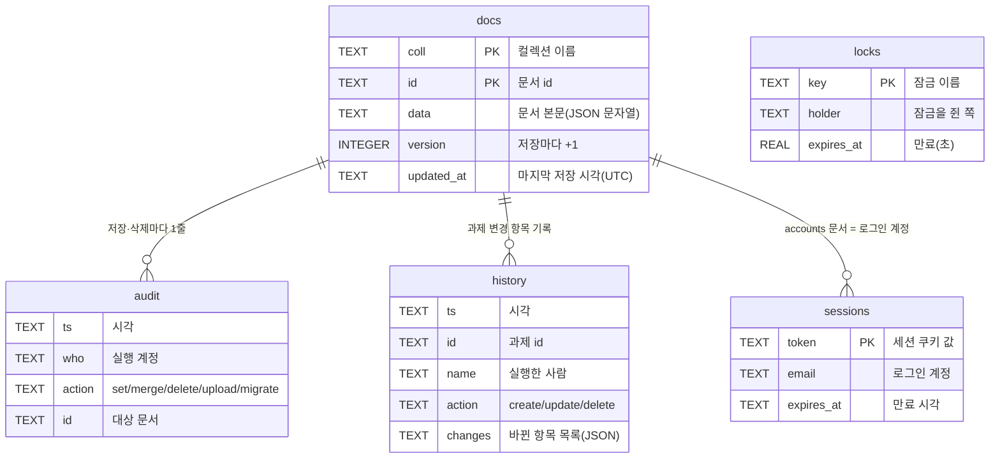

# 데이터 모델·스키마

허브의 데이터가 어디에 어떤 모양으로 저장되는지, 과제 문서에는 어떤 칸이 있는지 답하는 페이지입니다.
데이터는 SQLite 파일 하나(`hub.db`)에 모두 들어 있고, 첨부파일 실물만 서버 폴더에 따로 둡니다.

## 1. 표는 5개뿐입니다

서버(`server/app.py`)는 과제마다 표를 나누지 않고, **문서(JSON) 하나를 한 줄에 담는 표** 하나만 씁니다.
나머지 4개는 로그인·잠금·기록용 부속 표입니다.

| 표 | 열 | 용도 |
|---|---|---|
| `docs` | `coll`, `id`, `data`(JSON 문자열), `version`, `updated_at` | 모든 문서. `(coll, id)`가 기본키. 저장할 때마다 `version`이 1씩 올라갑니다 |
| `sessions` | `token`, `email`, `created_at`, `expires_at` | 로그인 세션(쿠키 `hub_sid`, 7일). 새 세션을 만들 때 만료된 줄을 함께 지웁니다 |
| `locks` | `key`, `holder`, `expires_at` | 짧은 편집 잠금. `expires_at`은 초 단위 실수(TTL) |
| `audit` | `ts`, `who`, `action`, `coll`, `id`, `detail` | 누가·언제·무엇을 저장(`set`/`merge`)·삭제(`delete`)·업로드(`upload`)했는지 |
| `history` | `ts`, `coll`, `id`, `who`, `name`, `action`, `changes` | v3.21에 추가. 과제가 저장될 때 **바뀐 항목만** 남깁니다(9절) |

`history`에는 조회용 인덱스 `history_doc(coll, id, ts)`가 함께 만들어집니다.
표는 서버가 기동할 때 `init_db()`가 `CREATE TABLE IF NOT EXISTS`로 만들므로, 별도 스키마 관리 도구가 없습니다.

!!! note "왜 컬렉션마다 표를 만들지 않았나"
    화면(`hub.html`)이 Artifact 런타임의 문서형 저장소(`컬렉션/문서 id`)를 그대로 쓰기 때문입니다.
    서버판도 같은 모양을 유지해야 화면 소스를 한 벌로 쓸 수 있습니다. → [ADR-0003](adr/0003-document-store-on-sqlite.md)

## 2. 컬렉션 5종

`COLLS = {"projects", "events", "accounts", "meta", "links"}` 다섯 개만 허용하고, 그 밖의 이름으로 들어오면 404를 돌려줍니다.
Artifact판에서 쓰던 컬렉션 구성과 **1:1로 같습니다**.

| 컬렉션 | 문서 id | 용도 |
|---|---|---|
| `projects` | 서버가 만든 20자 임의 문자열(초기 적재분은 `seed-NN`) | 과제(프로젝트) 1건 |
| `events` | 서버가 만든 임의 문자열 | 일정 1건 |
| `accounts` | 로그인 이메일(소문자) | 계정 1개 |
| `links` | 서버가 만든 임의 문자열 | 업무 영역별 바로가기 1개 |
| `meta` | `seed`, `seedlock`, `approvers`, `patch1` | 시스템 플래그·관리자 사전 명단 |

## 3. projects — 과제 문서

화면의 입력 칸은 `hub.html`의 `FIELDS` 상수 하나로 정의되고, 등록 창은 이를 A·B 두 절로 나눠 그립니다. 아래 표의 `필드`가 저장되는 JSON 키입니다.

### 3.1 A절 · 그룹 대시보드(기획팀) 등록 항목

| 필드 | 화면 이름 | 형식 | 필수 |
|---|---|---|---|
| `title` | 과제명 | 한 줄 글 | ● |
| `owner` | 담당자 | 한 줄 글(이름) | ● |
| `ownerEmail` | 담당자 계정 | 계정 선택 — 수정·삭제 권한 판정 기준 | |
| `category` | 카테고리(업무 영역) | 선택 10종(그룹 기준 분류) | ● |
| `startDate` | 시작일 | 날짜 | |
| `targetDate` | 목표 완료일 | 날짜 | |
| `current` | 현재 업무 방식(AI 도입 전) | 여러 줄 글 | ● |
| `goal` | AI 활용 목표 | 여러 줄 글 | ● |
| `effect` | 기대효과 | 여러 줄 글 | |
| `timeFreq` · `costFreq` | 시간·비용 절감 · 빈도 | 선택 `매일 / 주 2~3회 / 주 1회 / 월 2~3회 / 월 1회 / 분기 1회 / 연 1회` | |
| `timeCycle` | 시간 절감 · 주기 | 선택 `회당 / 매 근무일 / 주당 / 월간 / 분기당 / 연간` | |
| `timeValue` · `timeUnit` | 시간 절감 · 절감 시간과 단위 | 숫자 문자열 + 선택 `분 / 시간`(비면 `시간`) | |
| `costCycle` | 비용 절감 · 주기 | 선택 `건당 / 매 근무일 / 주당 / 월간 / 분기당 / 연간` | |
| `costAmount` · `costBasis` | 비용 절감 · 금액(원)과 근거 | 숫자 문자열 + 한 줄 글 | |
| `errSave` | 오류 절감 | 선택 `있음 / 없음` | |
| `manual` | 사용안내(매뉴얼) | 여러 줄 글 | 개발 상태가 `운영중`일 때만 ● |
| `url` | 링크(URL) | 한 줄 글. 주소 형식만 저장(앞에 `https://`를 자동으로 붙여 줍니다) | |
| `docsUrl` | 개발 문서 사이트(URL) | 선택. 그 과제의 개발 문서(MkDocs 공개 사이트) 주소. 편집 폼에 "개발 문서 사이트란?" 안내문이 함께 있고, 목록·메인 카드·상세 창에서 `[문서 ↗]`로 열림 (v3.22) | |
| `files` | 첨부파일 | 배열 `[{id, name, size, by, at}]` — 사내 서버판에서만 올릴 수 있습니다 | |
| `toPlanning` | ★ 기획팀 전달 대상 | 참/거짓 — 켜면 승인 절차 대상이 됩니다 | |
| `planningNote` | 기획팀 등록 상태 메모 | 한 줄 글 | |
| `planningId` | 그룹 대시보드 과제번호 | 한 줄 글 | |

`FIELDS`의 `_saving`은 저장되는 칸이 아니라 효과 지표 묶음의 안내 줄입니다. 다만 **효과 지표 자체는 필수**이며, 시간 절감(절감 시간)과 비용 절감(금액) 중 한 세트가 채워져야 통과합니다(`savingOk`). → [효과 지표](savings.md)

### 3.2 B절 · 자금팀 내부 관리 항목

| 필드 | 화면 이름 | 형식 | 필수 |
|---|---|---|---|
| `area` | 업무 영역(메인 화면 분류) | 선택 `입출금 / 금융 / 공시 / 외부 제출 / 보고 및 내부 관리 / 기타` | ● |
| `hideHome` | 메인 화면에서 숨김 | 참/거짓 | |
| `kind` | 항목 구분 | 선택 `AI 활용 개발 / 시스템 프로세스 개선` | ● |
| `status` | 개발 상태 | 선택 `구상 / 개발중 / 운영중 / 중단` | ● |
| `server` | 서버 위치 | 선택 `개인 PC / 자금팀 서버 PC / 버셀(Vercel) 서버 / 기타` | |
| `scope` | 사용 범위 | 선택 5종(`기타`를 고르면 직접 쓴 문구가 저장됩니다) | |
| `schedule` | 실행 주기·시점 | 한 줄 글 | |
| `login` | 로그인 절차 유무 | 선택 `있음 / 없음` | |
| `note` | 비고 | 여러 줄 글 | |

### 3.3 시스템 필드(화면에 입력 칸이 없는 값)

| 필드 | 값 | 뜻 |
|---|---|---|
| `approval` | `draft` / `pending` / `approved` (키가 없으면 승인된 기존 자료로 읽습니다) | 초안 · 승인 대기 · 승인됨 |
| `req` | `{type, state, data, requestedBy, requestedByEmail, createdAt, requestedAt, updatedAt, rejectNote}` | 승인된 과제의 수정·삭제 요청. `type`은 `update`/`delete`, `state`는 `draft`/`pending`. `update`의 `data`에 요청된 새 내용이 통째로 들어 있고, 승인하면 본문에 덮여 씁니다 |
| `createdAt` · `createdBy` · `createdByEmail` | 시각·이름·계정 | 등록 정보. '본인 초안' 판정에 `createdByEmail`을 씁니다 |
| `updatedAt` · `updatedBy` / `approvedAt` · `approvedBy` / `requestedAt` · `requestedBy` | 시각·이름 | 마지막 저장 · 승인 · 등록 승인 요청 정보 |
| `rejectNote` · `rejectedAt` · `rejectedBy` | 글·시각·이름 | 반려 사유와 반려자 |
| `ord` | 정수 | 목록 정렬용 순번(기존 최대값 + 1) |

## 4. events — 일정 문서

| 필드 | 뜻 |
|---|---|
| `date` | 날짜(`YYYY-MM-DD`) |
| `title` | 제목 |
| `type` | `만기` / `마감·제출` / `상환·지급` / `회의` / `기타` |
| `note` | 메모 |
| `company` · `bank` · `currency` · `account` · `rate` · `amount` | 회사·은행·통화·계좌·환율·금액. 등록 때는 채운 칸만 저장됩니다 |
| `createdAt` · `createdBy` · `createdByEmail` · `updatedAt` · `updatedBy` | 등록·수정 정보 |

## 5. accounts — 계정 문서

| 필드 | 뜻 |
|---|---|
| `email` · `name` · `company` | 계정·이름·회사(이메일 도메인으로 자동 결정) |
| `role` | `admin`(관리자) / `member`(일반) / `viewer`(조회 전용) |
| `status` | `pending`(가입 신청) / `verified` / `approved`(승인) / `rejected`(거절) / `disabled`(비활성) |
| `pwSalt` · `pwHash` | PBKDF2-SHA256 15만 회 해시와 소금값. **API로 절대 나가지 않습니다** |
| `mustChangePw` | 임시 비밀번호 상태. 참이면 로그인 직후 변경 창이 열립니다 |
| `createdAt` · `updatedAt` · `approvedAt` · `approvedBy` · `lastLoginAt` | 생성·수정·승인·마지막 로그인 |
| `pwChangedAt` · `pwResetAt` · `pwResetBy` · `rejectedAt`·`rejectedBy` · `disabledAt`·`disabledBy` | 비밀번호·상태 변경 기록 |

## 6. links — 바로가기 문서

`area`, `title`, `desc`, `url`, `ord`, `createdAt` · `createdBy` · `createdByEmail`, `updatedAt` · `updatedBy`.
업무 영역 카드 아래에 뜨는 외부 시스템·문서 링크이고, 승인 절차가 없습니다.

## 7. meta — 시스템 플래그 4종

| 문서 id | 내용 |
|---|---|
| `seed` | `{done, at, count}` — 초기 과제 적재를 이미 했다는 표시 |
| `seedlock` | 초기 적재가 동시에 두 번 돌지 않게 잡는 잠금(`/api/lock`) |
| `approvers` | `{emails[], updatedAt, updatedBy}` — 아직 가입하지 않은 관리자 예정 계정 목록. 그 계정이 가입하면 `role=admin`으로 시작하고 명단에서 빠집니다 |
| `patch1` | 초기 적재분 한 건에 링크를 채운 1회성 보정 플래그 |

## 8. 첨부파일 실물

문서에는 목록(`files` 배열)만 두고, 파일 자체는 서버 폴더 `server/uploads/`에 파일 두 개로 둡니다 —
`<id>.bin`(내용 그대로)과 `<id>.json`(`{id, name, size, by, byEmail, at}`).
`<id>`는 16자리 16진수이고, 이 형식이 아니면 서버가 조회를 거부합니다.
파일 한 개는 20MB까지이며, 내려받기는 항상 첨부(다운로드)로만 나갑니다. → [ADR-0007](adr/0007-attachments-on-filesystem.md)

## 9. 마이그레이션과 옛 값 읽기

- **기동 시 1회 변환**: 서버가 켜질 때 `migrate_savings()`가 옛 절감 칸(`freq`/`saveTime`/`saveUnit`/`saveCost`, `timeHours`)을 그룹 기준 칸으로 바꿉니다. 분은 시간으로 환산하고, 선택 목록에 없거나 숫자가 아닌 값은 비고 끝에 `(구)`로 남깁니다. 승인 대기 중인 요청(`req.data`) 안의 값도 같이 바꾸고, 바꾼 건수는 `audit`에 `migrate`로 기록됩니다.
- **별칭으로 읽기**: 옛 개발 상태 `시범운영`은 `개발중`으로, 옛 업무 영역 `외부제출`은 `외부 제출`로 읽습니다(`STATUS_ALIAS`, `AREA_ALIAS`).
- **변경 이력**: 저장할 때 `hist_record()`가 이전·새 문서를 비교해 바뀐 항목만 `history`에 넣습니다(값 200자까지, 매번 바뀌는 메타 칸 제외). → [ADR-0010](adr/0010-server-side-history.md)

---

## 관련 문서

- [API](api.md) — 이 문서들을 읽고 쓰는 경로
- [역할·권한 (RBAC)](rbac.md) — 어떤 필드를 누가 바꿀 수 있는지
- [효과 지표 (그룹 AX 동일 기준)](savings.md) — 절감 칸의 계산식
- [ADR-0003 · 문서형 저장소(SQLite 단일 표)](adr/0003-document-store-on-sqlite.md)
