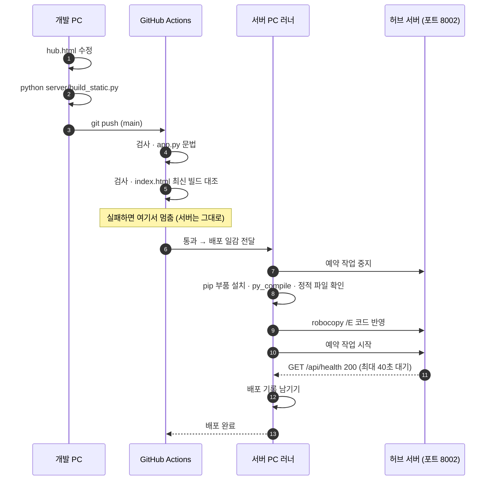
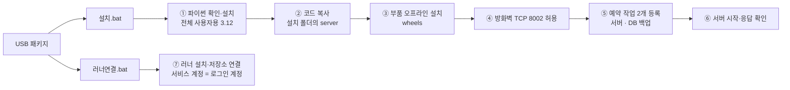

# 배포 (GitHub Actions → 사내 서버 PC)

이 페이지는 "내 PC에서 화면을 고친 다음 팀원이 그것을 보게 되기까지 무슨 일이 벌어지는가"에 답합니다. 코드는 GitHub 비공개 저장소 `SinokorOfficial/finance-team-hub` 에 있고, 사내 서버 PC 안에서 대기하는 **self-hosted runner** 가 그 코드를 받아 스스로 반영합니다. 사람이 서버 PC에 원격 접속할 필요가 없습니다.

## 한눈에 보기

| 단계 | 어디서 | 무엇이 |
|---|---|---|
| ① 수정 | 개발 PC | `hub.html` 만 고칩니다 |
| ② 빌드 | 개발 PC | `python server/build_static.py` → `server/static/index.html` 갱신 |
| ③ 확인 | 개발 PC | `server/run.bat` 으로 띄워 `http://127.0.0.1:8002` 에서 확인 |
| ④ push | 개발 PC → GitHub | `git add -A` → `git commit` → `git push` (`main`) |
| ⑤ 검사 | GitHub(ubuntu) | `app.py` 문법 검사 + `index.html` 이 최신 빌드인지 대조 |
| ⑥ 배포 | 사내 서버 PC(러너) | `server/deploy.ps1` 실행 |
| ⑦ 확인 | GitHub Actions 탭 | 초록 체크 = 서버 반영 완료(보통 2~3분). 팀원은 새로고침만 |

## 흐름

## ② 빌드 — `build_static.py` 가 하는 일

화면 원본 `hub.html` 은 claude.ai Artifact에서도 열리도록 만들어져 있어서, 사내 서버판으로 내보낼 때 세 가지를 바꿔야 합니다. 그 변환을 이 스크립트가 합니다.

| 바꾸는 것 | 이유 |
|---|---|
| SheetJS CDN 태그 → `/vendor/xlsx.full.min.js` | 사내망에서 인터넷 없이도 엑셀 업로드가 동작하게 |
| 그 자리에 `<script src="/shim.js">` 삽입 | 연결 층이 본문 스크립트보다 **먼저** 실행되어야 저장소·로그인이 서버에 연결됨 |
| `<!doctype>` · `<head>` · 기본 스타일 보강 | Artifact 런타임이 깔아 주던 `[hidden]{display:none!important}` 등이 없으면 숨긴 로그인 게이트가 화면을 가림 |

CDN 태그를 찾지 못하면 스크립트가 그 자리에서 멈춥니다(`assert`). 그 외 내용은 원본과 한 글자도 다르지 않습니다.

!!! warning "빌드를 빠뜨리면 ⑤ 검사에서 막힙니다"
    `server/static/index.html` 은 빌드 산출물입니다. 직접 고치지 말고, `hub.html` 을 고친 뒤 반드시 `build_static.py` 를 다시 실행하세요. GitHub 쪽 검사가 커밋된 `index.html` 을 옆에 복사해 두고 `build_static.py` 를 다시 돌려 두 파일을 비교하기 때문에, 빌드를 빠뜨리면 배포가 시작조차 하지 않습니다.

## ⑤ 검사 — GitHub 쪽(`deploy.yml` 의 `test` 잡)

`ubuntu-latest` 에서 파이썬 3.12로 두 가지만 봅니다.

1. `python -m py_compile server/app.py` — 서버 문법 오류를 서버에 올리기 전에 잡습니다.
2. 커밋된 `server/static/index.html` 을 따로 복사해 두고 `python server/build_static.py` 를 실행한 뒤 `cmp` 로 대조 — 다르면 오류 메시지와 함께 실패합니다.

`concurrency: hub-deploy` 로 묶여 있어 배포가 동시에 두 개 돌지 않습니다. Pull Request에서는 검사만 하고 배포 잡은 건너뜁니다(`main` 브랜치 push만 배포).

!!! tip "배포를 건너뛰고 싶을 때"
    커밋 메시지에 `[skip ci]` 를 넣으면 GitHub Actions가 아예 돌지 않습니다. 문서 수정, 개인 도구 정리처럼 서버 동작과 무관한 커밋에 씁니다.

## ⑥ 배포 — 서버 PC 쪽(`deploy.ps1`)

러너는 `[self-hosted, windows, hub]` 라벨로 지정되며, 서버 PC에서 **Windows 서비스**로 상시 대기합니다. 일감을 받으면 저장소를 받아 `server/deploy.ps1` 을 실행합니다. 스크립트 순서는 이렇습니다.

| 순서 | 내용 | 실패하면 |
|---|---|---|
| 1. 설치 확인 | 설치 폴더(`D:\자금팀허브` 또는 `C:\자금팀허브` 중 `hub.db` 가 있는 쪽)와 서버 예약 작업이 있는지 확인. 파이썬 경로는 설치 때 만들어진 `start_hub.bat` 에서 읽음 | 즉시 중단. USB 설치를 먼저 하라고 안내 |
| 2. 서버 중지 | 예약 작업 중지 + 8002 포트를 잡고 있는 프로세스 정리 | — |
| 3. 부품 설치 | `pip install -r requirements.txt` | 기존 서버를 **다시 켜고** 중단 |
| 4. 배포 전 검사 | `py_compile app.py` + `static/index.html` · `static/shim.js` · `static/vendor/xlsx.full.min.js` 존재 확인 | 기존 서버를 **다시 켜고** 중단 |
| 5. 코드 반영 | `robocopy /E` 로 `server` 폴더 복사. `VERSION.txt` 에 커밋 해시·시각 기록 | 기존 서버를 **다시 켜고** 중단 |
| 6. 서버 시작 | 예약 작업 시작 후 `/api/health` 를 1초 간격으로 최대 40초 확인 | `server.log` 마지막 20줄을 출력하고 실패 처리 |
| 7. 기록 | `logs\deploy.log` 에 커밋 해시와 결과 한 줄 | — |

**복사에서 제외하는 것**: `hub.db` · `hub.db.bak-*` · `*.pyc` · `start_hub.bat` · `stop_hub.bat` · `backup_db.bat`, 그리고 `__pycache__` 폴더. `/E` 는 "없는 것을 지우지 않고 덧쓰기"라서 데이터·백업·설치 때 생성된 배치는 그대로 남습니다.

!!! note "서버를 예약 작업으로만 띄우는 이유"
    러너가 직접 띄운 프로세스는 배포 잡이 끝날 때 러너가 함께 정리해 버립니다. 그래서 서버는 반드시 예약 작업으로 띄우고, 예약 작업이 없으면 `deploy.ps1` 은 폴백 없이 중단합니다. 예약 작업의 등록 계정·로그온 방식은 [ADR-0006](adr/0006-scheduled-tasks-user-s4u.md) 참조.

## 실패했을 때

배포 실패는 **코드가 복사되기 전**과 **복사된 후** 둘로 나뉘고, 대처가 다릅니다.

| 어디서 실패 | 서버 상태 | 할 일 |
|---|---|---|
| ⑤ GitHub 검사 | 손대지 않음 — 이전 버전 그대로 서비스 중 | 로그의 오류를 고치고 다시 push. `index.html` 불일치라면 `build_static.py` 실행 후 커밋 |
| ⑥ 1~5단계(코드 복사 전) | 스크립트가 **기존 서버를 다시 켜고** 중단 — 이전 버전 그대로 서비스 중 | Actions 로그에서 pip·문법·robocopy 중 무엇이 걸렸는지 확인해 고치고 다시 push |
| ⑥ 6단계(코드 복사 후, 서버 미응답) | 새 코드가 올라간 상태로 멈춤 — **서비스 중단** | Actions 로그에 함께 출력된 `logs\server.log` 마지막 20줄을 보고 원인을 고쳐 다시 push. 급하면 백업으로 되돌리는 방법은 [서버 PC 운영](operations.md) 참조 |

!!! tip "러너가 죽었을 때의 수동 배포"
    러너 서비스가 내려가 있으면 배포 잡이 대기 상태로 남습니다. 이때는 서버 PC에서 저장소를 받아 `powershell -ExecutionPolicy Bypass -File server\deploy.ps1` 을 직접 실행하면 같은 결과가 됩니다. `deploy.bat`(공유 폴더 복사)과 `update.bat`(`git pull` 후 재시작)은 옛 방식·예비 수단이며 평소에는 쓰지 않습니다.

배포된 버전을 확인하는 자리는 두 곳입니다 — 설치 폴더의 `server\VERSION.txt`(커밋 해시·시각)와 `logs\deploy.log`(배포 기록). 서버 PC에 접속하지 않고 확인하려면 GitHub Actions의 **서버 진단**(`diag.yml`) 워크플로우를 수동 실행하면 됩니다(읽기 전용).

## 서버 PC 최초 설치 (요약)

새 서버 PC에 처음 올릴 때는 배포 경로가 아니라 USB 설치 패키지를 씁니다. 배포는 "이미 설치된 곳의 코드만 갱신"하는 절차이므로, 설치가 안 된 PC에서는 `deploy.ps1` 이 1단계에서 중단됩니다.

| 단계 | 내용 |
|---|---|
| ① 파이썬 | `Program Files` 에 설치된 실물 3.12/3.13만 인정합니다. 사용자 폴더의 런처는 다른 계정 컨텍스트에서 런타임을 찾지 못해 배제하며, 없으면 USB에서 3.12를 전체 사용자용으로 설치합니다 |
| ② 코드 복사 | 고정 디스크인 `D:` 를 우선하고, 조건이 맞지 않으면 `C:` 에 설치합니다 |
| ③ 부품 | USB에 담긴 오프라인 wheels로 설치(3.12/3.13용). 그 외 버전은 인터넷에서 받습니다 |
| ④ 방화벽 | 인바운드 TCP 8002 허용 규칙 추가 |
| ⑤ 예약 작업 | 서버 상시 실행(부팅 시, 실행 시간 제한 없음, 실패 시 재시작)과 DB 일일 백업 2개를 XML로 등록. 등록 20초 뒤 작업이 남아 있는지 다시 확인합니다 |
| ⑥ 확인 | 서버를 띄우고 응답을 확인합니다 |
| ⑦ 러너 | `러너연결.bat` 으로 GitHub self-hosted runner를 설치해 저장소에 연결. 서비스 계정은 **반드시 그 PC의 로그인 계정**으로 지정합니다(기본값인 네트워크 서비스 계정은 예약 작업을 재시작할 권한이 없어 배포가 실패합니다) |

설치 후 감시(`watchdog.ps1`)·첨부 백업(`backup_uploads.ps1`) 예약 작업은 서버 PC에서 `server\tools\작업등록.bat` 을 한 번 실행해 등록합니다. 되돌리기는 `제거.bat`(예약 작업·방화벽·폴더 제거, 데이터는 남김), 예약 작업만 다시 등록하려면 `tools` 폴더의 재등록 배치를 씁니다.

!!! note "세부 설치 절차는 사내 문서를 보세요"
    실제 설치 경로·계정·러너 등록 토큰 발급 화면·백신 정책 관련 조치처럼 사내 실값이 필요한 부분은 이 공개 문서에 담지 않았습니다. 저장소의 `server/README.md` 와 `usb/` 폴더의 설치 기록·인수인계 메모, 그리고 사내 인수인계 문서를 참조하시기 바랍니다.

---

**관련 문서**

- [모듈 맵](modules.md)
- [아키텍처 개요](architecture.md)
- [서버 PC 운영](operations.md)
- [인수인계 체크리스트](handover.md)
