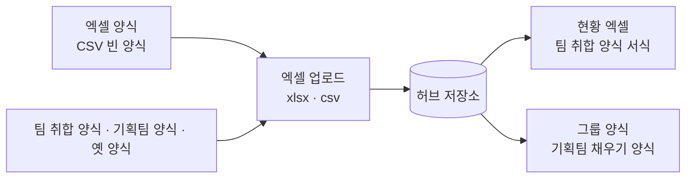

# 엑셀 양식·업로드·내보내기

프로젝트 화면의 엑셀 버튼 4개가 각각 무엇을 만들고 무엇을 읽는지, 어떤 머리글을 알아보는지 정리했습니다. 일정 화면의 업로드 양식도 함께 다룹니다.

## 네 기능 한눈에



| 버튼 | 방향 | 형식 | 만드는 곳 |
|---|---|---|---|
| 엑셀 양식 | 내려받기 | CSV | 화면 (`templateCsv`) |
| 엑셀 업로드 | 올리기 | xlsx · xls · xlsm · csv | 화면 (`parseWorkbook`) |
| 현황 엑셀 | 내려받기 | xlsx | 서버 (`export_xlsx.py`) |
| 그룹 양식 | 내려받기 | xlsx | 서버 (`export_group.py`) |

!!! note "xlsx 는 서버가 만듭니다"
    화면(브라우저)은 서식이 살아 있는 xlsx 를 만들 수 없어 CSV까지만 담당하고, 서식을 그대로 유지해야 하는 두 양식은 서버가 openpyxl로 원본 파일을 열어 채웁니다. 사내 서버판에서만 `[현황 엑셀]`·`[그룹 양식]` 버튼이 보입니다.

## 1. 양식 CSV 내려받기

`XL_COLS` 상수가 열 순서와 각 열의 안내 문구를 갖고 있습니다. 내려받은 파일은 두 줄입니다 — 첫 줄이 머리글, 둘째 줄이 `(예시)` 로 시작하는 안내 행(업로드할 때 자동으로 걸러집니다). 맨 앞에 BOM(``)을 붙여 엑셀에서 한글이 깨지지 않게 합니다.

열은 30개이고, 순서는 다음과 같습니다.

| 묶음 | 열 |
|---|---|
| 식별 | 과제명 * · 담당자 * · 담당자 이메일 · 업무 영역 * · 카테고리(업무 영역) * |
| 기간 | 시작일 · 목표 완료일 |
| 내용 | 현재 업무 방식 * · AI 활용 목표 * · 기대효과 · 사용안내(매뉴얼) 요약 * |
| 효과 지표 | 시간절감 빈도 · 주기 · 시간 · 단위 / 비용절감 빈도 · 주기 · 금액(원) · 근거 / 오류 절감 |
| 내부 관리 | 항목 구분 * · 개발 상태 * · 서버 위치 · 사용 범위 · 실행 주기·시점 · 로그인 절차 유무 · 링크(URL) · 비고 |
| 그룹 | 그룹 과제번호 · 그룹 등록 메모 · ★ 기획팀 전달 대상 |

안내 문구는 상수에서 만들어 냅니다. 예를 들어 '업무 영역' 열의 안내는 `AREA_KEYS.join(" / ")`, '시간절감 주기'는 `TIME_CYCLES.join(" / ")` 이라서 코드에서 선택지를 고치면 양식 안내도 같이 바뀝니다.

## 2. 엑셀 업로드

### 머리글 인식 (`XL_HEAD`)

파일마다 열 이름이 다르므로, 머리글을 정규화한 뒤 정규식으로 필드를 찾습니다.

- 정규화(`xlNorm`): 공백 전부 제거 + `*` 제거. 그래서 `과제명 *`, `과제 명`, `과제명` 이 모두 같게 읽힙니다.
- 시트 선택 순서: 이름에 `취합`·`목록`·`등록`·`양식` 이 든 시트를 먼저 보고, 그다음 나머지 시트를 봅니다.
- 머리글 줄 찾기: 위에서 15행까지 훑어 **`과제명` 이 있고 인식된 열이 3개 이상**인 줄을 머리글로 삼습니다.
- 과제명이 빈 행, `(예시)` 로 시작하는 행, 안내 행(`프로젝트 이름`, 담당자가 `본인 이름`)은 건너뜁니다.

덕분에 허브 양식 CSV, 메일로 돌던 팀 취합 양식, 옛 절감 열이 있는 파일이 모두 올라갑니다.

### 옛 절감 열 자동 변환

| 옛 열 | 변환 |
|---|---|
| `절감 빈도` | `timeFreq` |
| `회당 절감 시간` | `timeValue`, 주기가 비었으면 `timeCycle = "회당"` |
| `월 비용 절감액` | `costAmount`, 주기가 비었으면 `costCycle = "월간"` |
| `시간 단위` | `분`/`시간` 으로 정리, 값만 있고 단위가 없으면 `시간` |

이 밖에도 읽는 김에 정리합니다.

- 날짜: 엑셀 날짜 값(숫자·Date)과 `2026.1.5` 같은 표기를 모두 `2026-01-05` 로(`xlDate`). 숫자 칸은 쉼표·공백·`원` 을 떼어 냅니다.
- URL: 링크 열이 비었는데 비고에 `http…` 가 있으면 링크로 옮기고, 형식이 안 맞으면 비웁니다.
- 담당자 계정: 이메일 열이 있으면 소문자로, 없으면 담당자 **이름과 정확히 같은** 승인 계정이 딱 하나일 때만 자동 연결합니다(동명이인이면 연결하지 않습니다).
- 상태·카테고리·업무 영역·빈도·주기·단위가 목록에 없으면 경고를 달고, 그룹 목록 항목은 값을 **비웁니다**.

### 미리보기 창

읽은 행은 바로 저장하지 않고 확인 창(`openUpload` → `.uptbl`)에 먼저 보여 줍니다.

열은 처리(`신규 등록`/`기존 갱신`/`건너뛰기` — 행마다 바꿀 수 있음) · 과제명(기존 건이면 매칭된 과제명도) · 담당자 · 상태 · 업무 영역 · 그룹 대시보드(★) · 비고(경고 문구 + `시트!행` 위치)입니다.

- 과제명이 정규화 기준으로 같은 과제가 있으면 `기존 갱신`, 없으면 `신규 등록`. 신규 행은 업무 영역을 반드시 골라야 반영됩니다.
- 기존 건인데 내가 관리자도, 그 과제의 담당자 계정도 아니면 `건너뛰기` 로 고정하고 이유를 붙입니다.
- 맨 아래에 `신규 n건 · 기존 갱신 n건 · 건너뛰기 n건` 을 셉니다.

`[반영]` 을 누르면 확인창이 한 번 더 뜨고, 그다음 규칙대로 저장합니다.

| 처리 | 관리자 | 일반 계정 |
|---|---|---|
| 신규 등록 | 즉시 승인 상태로 등록 | `승인 대기` 로 등록 |
| 기존 갱신 | 즉시 반영 | ★ 아닌 내 과제는 즉시, ★ 과제는 수정 승인 요청 |

기존 갱신은 **파일에 값이 적힌 칸만** 덮어씁니다(빈 칸은 기존 값을 지우지 않습니다). 줄바꿈·공백만 다른 과제명은 원문 줄바꿈을 지키려고 덮어쓰지 않습니다. 수정한 사람은 `updatedBy` 에 `(엑셀 업로드)` 로 남습니다.

### 드래그 앤 드롭

프로젝트 화면에 파일을 끌어다 놓으면 프로젝트 업로드, 일정 화면에 놓으면 일정 업로드로 갑니다(`setupDrop`).

- 놓을 수 있는 영역은 점선 테두리(`.view.dropping::after`)로 표시되고, 안내 문구는 각 `<section>` 의 `data-drop` 속성에서 가져옵니다.
- 엑셀·CSV 만 받고, 여러 개를 놓으면 첫 번째 하나만 처리하며 그 사실을 토스트로 알립니다. 화면 밖에 놓아도 브라우저가 파일을 열지 않게 문서 전체에서 기본 동작을 막습니다.
- 미리보기 모드·조회 전용 계정·엑셀 모듈 미로딩일 때는 토스트로 거절합니다.

## 3. 현황 엑셀 (`export_xlsx.py`)

승인된 과제 전부를 **팀 취합 양식 서식 그대로** xlsx 로 내려줍니다. 서식은 `server/templates/status_template.xlsx` — 배포 양식에서 데이터만 비운 판입니다.

| 항목 | 값 |
|---|---|
| 시트 | `취합` (`목록` 시트는 드롭다운 원본) |
| 데이터 첫 행 | 6행 |
| 서식 원본 행 | 20행 — 이 행의 서식을 데이터 행 전체에 복사 |
| 양식 마지막 행 | 31행 — 남는 행은 서식을 지워 빈 테두리가 남지 않게 |
| 열 | B~Y 취합 양식 열, Z `★ 등록 대상`, AA 사용안내(매뉴얼) 요약 · AB 링크(URL) · AC 첨부파일(매뉴얼 문서) · AD 개발 문서(URL) |
| 절감 8열 | K 시간절감 빈도 · L 주기 · M 시간(시간 단위) · N 비용절감 빈도 · O 주기 · P 금액(원) · Q 근거 · R 오류 절감 |
| 정렬 | 상태(운영중→개발중→구상→중단) → `createdAt` → `ord` — 화면 목록과 같은 순서 |
| 파일명 | `자금팀 AI 프로젝트 현황_YYYY.MM.DD.xlsx` |

세부 처리:

- M열(시간절감 시간)은 `hours_of()` 로 **시간 단위 숫자**로 바꿔 넣습니다(입력이 분이면 ÷60, 소수 둘째 자리까지). 양식에 단위 열이 없어서입니다.
- 시작일·목표 완료일은 `yyyy-mm-dd` 형식이면 진짜 날짜 값으로, M·P열은 숫자로 넣습니다.
- 행 높이는 열 너비와 글자 수(한글 2칸)로 줄 수를 추정해 24~160 사이로 잡습니다.
- openpyxl 이 저장할 때 엑셀 확장(x14) 드롭다운을 버리므로 11개 열의 드롭다운을 표준 유효성으로 **다시 걸어** 줍니다. `column_dimensions` 는 없는 키를 읽기만 해도 항목이 생겨 너비가 깨지므로 `items()` 로만 읽습니다(`col_widths`).
- AA~AC 세 열은 취합 양식에 없는 허브 추가 열이라, ★ 열(Z)의 서식을 복사해서 머리글·안내행·너비를 만듭니다.

### 양식 재편 스크립트 `rebuild_status_template.py`

2026-09-09 에 절감 항목을 그룹 기준으로 바꾸면서 양식 자체를 한 번 재편했습니다(옛 5열 → 새 8열, 뒤 열들을 두 칸 밀고 `목록` 시트에 주기 6종 추가). 1회성이지만 재실행 가능하게 남겨 두었고, 이미 재편된 양식이면 아무것도 하지 않습니다.

```
py server/rebuild_status_template.py
```

## 4. 그룹 채우기 양식 (`export_group.py`)

기획팀 그룹 AX 대시보드의 '등록된 과제 채우기' 양식을 채워 내려줍니다. 서식은 `server/templates/group_fill_template.xlsx` — 기획팀 배포본에서 데이터 행만 비운 판(표준 유효성 6개 유지)입니다.

대상은 승인된 과제 중 두 묶음입니다.

| 묶음 | 조건 | A열(과제번호) |
|---|---|---|
| 기존 과제 갱신 | `planningId` 가 있는 건 | 그 번호를 그대로 씀 |
| 새 과제 | 번호가 없고 ★(`toPlanning`)인 건 | 비움, 목록 맨 아래에 붙임 |

열 구성(A~Q, 17열, 데이터 10행부터):

| 열 | 내용 |
|---|---|
| A · B | 과제번호 · 출처(비움) |
| C~E | 담당자 · 과제명 · 업무영역(카테고리) |
| F · G | 현재 업무 방식 · AI 활용 목표 |
| H | 진행현황 — 운영중 → `완료`, 개발중·구상 → `진행중` |
| I | 목표 완료일 (문자 서식 `yyyy-mm-dd`) |
| J | 기대효과 |
| K~M | 시간절감 빈도 · 주기 · 시간 |
| N~Q | 비용절감 빈도 · 주기 · 금액 · 근거 |

- 2026-09-09 부터 허브 항목이 그룹 기준과 같아져서 **K~Q를 그대로 옮깁니다**([효과 지표](savings.md)).
- 시간은 현황 엑셀과 같은 `hours_of()` 로 분→시간 환산합니다.
- 목록에 없는 값, 숫자가 아닌 금액, 형식이 틀린 날짜, 양식에 없는 상태는 **비우고** 그 사실을 `notes` 로 모읍니다. 서버는 이 `notes` 를 응답 헤더 `X-Export-Info`(JSON, URL 인코딩)로 실어 보내고, 화면이 그것을 풀어 안내 문구로 보여 줍니다.
- 과제가 양식의 마지막 행(37행)보다 많으면 드롭다운 유효성 범위를 늘립니다.
- 파일명은 `장금상선(주)_자금팀_AX과제_채우기_YYYY.MM.DD.xlsx`.

## 5. 일정 업로드 양식

일정 화면의 `[일정 양식]` 은 CSV, `[일정 업로드]` 는 xlsx·csv 를 받습니다(드래그 앤 드롭 포함). 열은 `EV_COLS` 10개입니다.

| 열 | 필드 | 안내 |
|---|---|---|
| 날짜 * | `date` | `2026-09-15` 형식 |
| 제목 * | `title` | — |
| 유형 | `type` | 만기 / 마감·제출 / 상환·지급 / 회의 / 기타 |
| 회사 | `company` | 회사·법인명 |
| 은행 | `bank` | 금융기관명 |
| 통화 | `currency` | KRW / USD / JPY / CNY / EUR |
| 계좌 | `account` | 계좌번호 |
| 금리 | `rate` | 예: 3.10% |
| 금액 | `amount` | 예: ₩50,000,000,000 |
| 메모 | `note` | 선택 |

머리글 인식(`EV_HEAD`)은 프로젝트 쪽과 같은 방식이면서 표현을 더 넓게 받습니다 — 날짜는 `날짜·일자·기한·만기일`, 제목은 `제목·일정·내용·건명`, 유형은 `유형·구분·종류`, 메모는 `메모·비고·참고` 로도 읽습니다. 같은 날짜·같은 제목이 이미 있으면 미리보기에서 기본이 `건너뛰기` 입니다.

---

## 관련 문서

- [효과 지표 (그룹 AX 동일 기준)](savings.md)
- [기능 카탈로그](features.md)
- [데이터 모델·스키마](data-model.md)
- [API](api.md)
