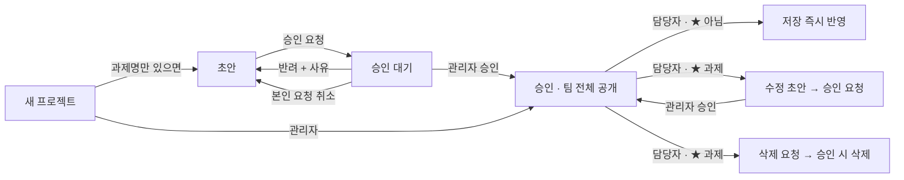

# 기능 카탈로그

화면별로 무엇을 할 수 있는지 정리했습니다. "누가" 할 수 있는지는 [역할·권한](rbac.md), 로그인 절차는 [인증](auth.md)을 참고하세요.

## 로그인 게이트

로그인하지 않으면 `.gate` 화면이 전체를 덮고, 그 뒤의 목록은 아무것도 내려오지 않습니다(서버가 `/api/db/…` 를 401로 막습니다).

- 탭 두 개(`로그인` / `회원가입`)를 `.gtab` 로 전환합니다.
- 회원가입은 허용 도메인(회사·계열사 도메인 2개, 화면 상수 `AUTH_DOMAINS` · 서버 `ALLOWED_DOMAINS`)만 받습니다. 가입 신청은 `status: "pending"` 으로 저장되고, 관리자가 승인해야 로그인됩니다.
- 로그인 유지 기간은 7일입니다(`SESSION_TTL`). 관리자가 비밀번호를 초기화하면 임시 비밀번호가 한 번만 표시되고, 그 비밀번호로 로그인하면 변경 창이 강제로 열립니다.

## 메인 — 업무 영역 6종 카드

`AREAS` 상수의 6개 영역이 카드 한 장씩입니다.

| 업무 영역 | 카드 설명(`AREAS[].d`) |
|---|---|
| 입출금 | 자금 현황·집행·환율·전표·해외법인 자금 |
| 금융 | 선박금융·차입·대여금 |
| 공시 | 공정거래법 공시 검토·DART |
| 외부 제출 | 외국환 신고·주채무계열·감사 제출자료 |
| 보고 및 내부 관리 | 경영 보고·현황 관리·모니터링 |
| 기타 | 위 영역에 속하지 않는 과제 |

카드 한 장의 구성은 이렇습니다.

- **머리(`.ahead`)** — 영역 이름·과제 수·설명. 누르면 프로젝트 탭으로 이동하며 그 영역만 필터됩니다.
- **상태 배지(`.adots`)** — 상태별 건수(`STATUS_VIEW` 순서, 0건은 생략).
- **과제 행(`.ai`)** — 왼쪽 막대(`.sq`)가 상태 색, 과제명을 누르면 상세 창. `url` 이 있으면 `[열기 ↗]` 로 새 탭.
- **더보기** — 카드당 기본 5건(`HOME_MAX`), 나머지는 `[더보기 ▾ (+n)]`(펼친 영역은 `homeExpanded`).
- **바로가기(`.alinks`)** — 팀이 자주 여는 외부 시스템·문서 링크.

과제에 `hideHome` 을 체크하면 메인 카드에서 빠지고 프로젝트 목록에만 남습니다.

### 바로가기 링크는 DB에 있습니다

바로가기는 코드에 박아 둔 목록이 아니라 `links` 컬렉션의 문서입니다(`{area, title, desc, url, ord, createdBy, createdByEmail}`).

- `[＋ 링크 추가]` 로 조회 전용이 아닌 누구나 추가할 수 있고, 저장하면 실시간 구독으로 팀 전체 화면에 바로 반영됩니다. **승인 절차가 없습니다.**
- 수정(✎)·삭제(✕)는 관리자 또는 등록한 본인만(`canEditLink`).
- 주소는 `safeUrl()` 로 `http`/`https` 만 받습니다. `links` 가 비어 있을 때만 코드의 기본 목록(`AREA_LINKS`)을 보여 줍니다.

## 프로젝트

### 상단 상태 버튼 7개 = 필터

`renderStats()` 가 `.stat` 버튼 7개를 그립니다. 누르면 `statFilter` 가 바뀌고, 같은 버튼을 다시 누르면 전체로 돌아옵니다.

| 버튼 | `statFilter` 값 | 세는 대상 |
|---|---|---|
| 전체 | `""` | 내가 볼 수 있는 과제 전부(`visibleTo`) |
| 운영중 / 개발중 / 구상 / 중단 | 상태값 | 승인된 과제 중 그 상태 |
| ★ 기획팀 전달 대상 | `star` | 승인된 과제 중 `toPlanning` |
| 승인 대기 | `pending` | 등록·수정·삭제 요청이 걸린 과제(`hasPending`) |

'승인 대기'가 1건 이상이면 관리자에게만 탭 배지(`.tbadge`)와 안내 줄(`.notice`)이 함께 나옵니다.

### 월 절감 합계 카드

버튼 줄 오른쪽 끝의 `.stat.total` 카드가 **지금 보이는 목록 기준** 월 절감 시간·금액 합계와 "효과 기입 n건 / 전체 m건" 을 보여 줍니다. 상태 버튼·업무 영역·담당자·검색을 바꾸면 그 범위로 다시 계산됩니다(`renderSavingTotal`). 계산 규칙은 [효과 지표](savings.md).

### 검색 · 업무 영역 · 담당자 필터

- 검색은 과제명·담당자·현재 업무 방식·목표·기대효과·사용안내·비용 근거·비고·카테고리·업무 영역을 이어 붙여 부분 일치로 찾습니다. 업무 영역은 `AREA_KEYS` 6종, 담당자는 등록된 담당자 이름 목록입니다.
- 정렬은 항상 운영중 → 개발중 → 구상 → 중단, 같은 상태 안에서는 등록일 → `ord` 순입니다(`sortProjects`).

### 목록 6+1열

`.prow` 는 7열 그리드입니다(넓은 화면 기준).

| 열 | 내용 |
|---|---|
| 상태 | `.pill` 상태 배지 |
| 과제명 | 과제명 + 상태 배지(초안·승인 대기·보완필요 등) |
| 업무 영역 · 서버 · 사용 범위 · 주기 | 값이 있는 것만 `·` 로 이어 붙임 |
| 월 절감 | 월 절감 시간 + 등급, 아랫줄에 월 절감액 |
| 링크 | `[열기 ↗]` · 첨부 개수 배지(📎 n) |
| 담당자 | 담당자 이름 |
| 그룹 대시보드 | ★ 와 그 아래 등록 상태 메모 |

820px 아래에서는 상태·과제명·링크 3열만 남습니다([디자인 시스템](design-system.md) 참고).

### 상세 창 — A절 · B절

목록의 행을 누르면 상세 창(`openModal`)이 열립니다. 위쪽에 등록자·등록일·담당자(계정)·최근 수정·승인 이력·그룹 과제번호가 `.mmeta` 로 나오고, 그 아래 입력 항목이 두 절로 갈립니다.

- **A · 그룹 대시보드(기획팀) 등록 항목** — 과제명, 담당자, 담당자 계정, 카테고리, 시작일/목표 완료일, 현재 업무 방식, AI 활용 목표, 기대효과, 효과 지표 블록, 사용안내(매뉴얼), 링크, 첨부파일, ★ 기획팀 전달 대상, 등록 상태 메모, 그룹 과제번호.
- **B · 자금팀 내부 관리 항목** — 업무 영역, 메인 화면 숨김, 항목 구분, 개발 상태, 서버 위치, 사용 범위, 실행 주기·시점, 로그인 절차 유무, 비고.

두 절은 하드코딩이 아니라 `FIELDS` 상수의 `sec: "A" | "B"` 로 갈라 그립니다(필드 정의는 [데이터 모델](data-model.md)).

### 상태 배지

`stateTag()` 와 `needFill()` 이 과제명 옆에 붙이는 배지입니다.

| 배지 | 뜻 |
|---|---|
| 초안 | 아직 승인 요청 전(등록자와 관리자에게만 보임) |
| 승인 대기 / 수정 승인 대기 / 삭제 승인 대기 | 관리자 처리를 기다리는 중 |
| 수정 초안 | 수정 내용을 요청 전 상태로 저장해 둔 것 |
| 보완필요 | 승인된 과제인데 필수가 비었음 — 사용안내(상태가 '운영중'일 때) 또는 효과 지표 |

'보완필요'는 그룹 AX 대시보드의 같은 이름 표시와 같은 뜻입니다.

### 등록 · 수정 · 삭제 승인 워크플로우

- 관리자는 `[등록]`·`[저장]`·`[삭제]` 한 번으로 즉시 반영됩니다.
- 일반 계정은 **담당자 계정이 자기 계정인 과제만** 손댈 수 있습니다(`isOwner`, 이름이 아니라 계정으로 판정 — [ADR-0004](adr/0004-owner-by-account-email.md)).
- ★ 표시된 과제는 승인 절차를 타고, ★ 아닌 과제는 담당자가 바로 저장·삭제합니다([ADR-0005](adr/0005-approval-only-for-starred.md)).
- 편집 중 ★ 를 새로 체크하면 그 저장이 자동으로 '수정 승인 요청' 경로로 바뀝니다. 관리자가 요청을 열면 변경 전·후 비교(`diffHtml` → `.mdiff`)가 붙고, 승인 대기 중에는 폼이 잠겨 요청자는 `[승인 요청 취소]` 만 할 수 있습니다.

### 임시저장

필수 항목을 다 못 채웠어도 저장해 둘 수 있는 길이 두 가지입니다.

- `초안 저장`·`수정 초안 저장` — 새 과제·초안·★ 과제 수정에서. 나(와 관리자)만 보이고 필수 검사가 없습니다.
- `임시저장` — 저장이 곧 팀 화면 반영인 경우(관리자, ★ 아닌 과제의 담당자)에만 보이며, 필수 검사를 건너뛴 채 저장합니다(목록에 '보완필요' 배지).

### 첨부파일

매뉴얼 문서·프로그램 파일 등을 과제에 붙입니다. **사내 서버판에서만** 올릴 수 있고 파일당 20MB(`MAX_UPLOAD`)입니다.

파일을 고르면 그 자리에서 서버에 올라가고, `[저장]` 을 눌러야 과제에 목록(`files: [{id, name, size, by, at}]`)으로 기록됩니다. 저장하지 않고 닫으면 이번에 올린 파일은 지웁니다(`cleanupNewFiles`). 이미 저장돼 있던 파일을 목록에서 빼면 과제에서만 빠지고 서버 파일은 남습니다([ADR-0007](adr/0007-attachments-on-filesystem.md)).

### 수정 이력

상세 창 위쪽 `.mhist` 를 펼치면 서버가 남긴 '바뀐 항목' 기록이 나옵니다(누가·언제·어떤 항목을 무엇에서 무엇으로). 화면이 계산하는 것이 아니라 서버가 쓰기 때마다 `history` 표에 남긴 것을 읽어 옵니다([ADR-0010](adr/0010-server-side-history.md)).

## 일정

- **달력** — 일정이 있는 날에 유형 색 점이 찍히고, 날짜를 누르면 그 날 목록이 달력 아래에 열립니다. `‹ ›` 로 달 이동, `[오늘]` 로 복귀.
- **다가오는 일정** — 오늘부터 2주 안. 오늘 날짜는 붉게 표시합니다.
- **월별 목록** — 달력에 표시된 달의 전체 일정. 지난 일정은 `[지난 일정 보기]` 로 펼칩니다.
- **일정 등록 · 상세** — 날짜·제목·유형·메모('상세 항목'을 펼치면 회사·은행·통화·계좌·금리·금액). 관리자 또는 등록한 본인이 상세 창에서 수정·삭제하며, **일정에는 승인 절차가 없습니다.**
- **엑셀 업로드** — `일정 양식` CSV를 받아 채운 뒤 올립니다(드래그 앤 드롭 가능). 같은 날짜·같은 제목은 기본으로 건너뜁니다. 자세한 열 구성은 [엑셀](excel.md).

유형은 `EVTYPES` 5종입니다: 만기 · 마감·제출 · 상환·지급 · 회의 · 기타.

## 계정 관리 (관리자 전용)

| 구역 | 하는 일 |
|---|---|
| 승인 대기 | 가입 신청 목록을 `[승인]`/`[거절]`. 탭 배지 숫자가 대기 인원 |
| 승인된 계정 | 권한(관리자/일반/조회 전용) 변경, `[비밀번호 초기화]`(임시 비밀번호 1회 표시), `[비활성화]`(즉시 로그아웃), 비활성 계정 `[다시 승인]`/`[삭제]`. 본인 권한은 못 바꿈 |
| 관리자 명단 | 관리자는 여러 명. 아직 가입하지 않은 이메일을 미리 올려 두면 그 사람이 승인될 때 자동으로 관리자가 됨. 본인 해제 불가, 관리자 간 우선순위 없음 |
| 담당자 계정 연결 실행 | 과제의 담당자 **이름**과 같은 이름의 승인 계정을 찾아 `ownerEmail` 에 한 번에 연결. 동명이인·미가입은 건너뛰고 메시지로 알려 줌 |

## 공통 UX

1. 무언가를 바꾸거나 지우는 동작 앞에는 반드시 확인창(`ask()`)이 뜨고, 되돌릴 수 없는 작업은 '주의' 머리말이 붙습니다.
2. 편집 중 내용을 고친 뒤 닫기·배경 클릭·Esc·뒤로가기를 하면 '저장하지 않고 닫을까요?' 를 묻습니다(`formDirty()`).
3. 탭과 상세 창은 브라우저 이력에 기록되므로 뒤로가기로 이전 화면·이전 탭으로 돌아갑니다.
4. 저장 결과는 화면 아래 토스트로 알리고, 오른쪽 위 '팀 공용 저장소 연결됨'(`.conn.on`)이 초록이면 실시간 반영 중이라는 뜻입니다.
5. 조회 전용 계정에서는 등록·수정 버튼이 CSS 한 줄로 사라집니다(`body[data-role="viewer"] .needs-edit`).

---

## 관련 문서

- [효과 지표 (그룹 AX 동일 기준)](savings.md)
- [엑셀 양식·업로드·내보내기](excel.md)
- [역할·권한 (RBAC)](rbac.md)
- [데이터 모델·스키마](data-model.md)
