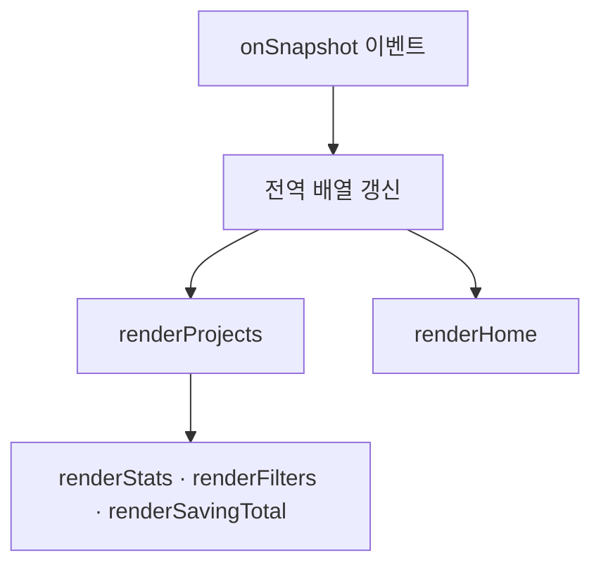
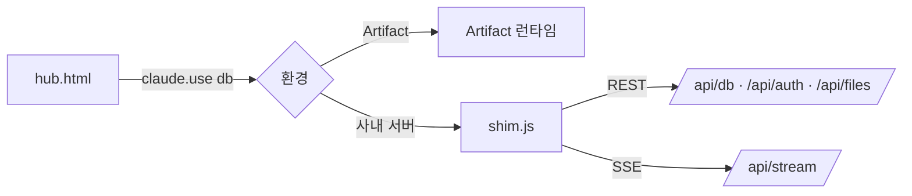

# 프론트엔드 아키텍처

화면은 `hub.html` **한 파일**입니다. 왜 한 파일인지, 그 안이 어떻게 나뉘는지, 사내 서버에 붙는 부분은 어디인지 정리했습니다.

## 스택

| 항목 | 내용 |
|---|---|
| 언어 | 순수 HTML + CSS + 바닐라 JavaScript (빌드 도구·프레임워크 없음) |
| 파일 | `hub.html` 한 장 (약 2,525줄 · 약 210KB) |
| 외부 라이브러리 | SheetJS(`xlsx`) 하나 — 엑셀 읽기·쓰기 |
| 글꼴 | IBM Plex Sans KR · IBM Plex Mono |
| 화면 상태 | 전역 변수 + 전체 재렌더 |

!!! note "왜 한 파일인가"
    허브는 Artifact(웹 문서 하나) 로 시작해서 사내 서버로 옮겨 왔습니다([ADR-0001](adr/0001-artifact-to-onprem.md)). 두 환경에서 **같은 화면 소스**를 쓰기로 정했기 때문에([ADR-0002](adr/0002-single-frontend-with-adapter.md)) 화면은 의존성 없는 한 파일로 유지하고, 환경 차이는 아래 '연결 층'이 흡수합니다.

## 파일 한 장의 구조

| 줄 범위 | 내용 |
|---|---|
| 1~6 | `meta`, `title`, 글꼴, SheetJS 스크립트 태그 |
| 7~378 | `<style>` — CSS 토큰과 모든 클래스([디자인 시스템](design-system.md)) |
| 379~673 | 마크업 — 상단 바, 뷰 4개(`section.view`), 모달 6개, 로그인 게이트, 토스트 |
| 674~2525 | `<script>` 하나 — 상수 · 상태 · 렌더 · 저장 · 엑셀 · 일정 · 계정 · 시작 |

뷰 전환은 라우터가 아니라 `section.view` 의 `active` 클래스 토글입니다.

## 상수 — 화면의 뼈대

선택지·필드·색을 코드 곳곳에 흩지 않고 스크립트 맨 위 상수에 모읍니다. 화면·엑셀 양식·검증 스크립트가 모두 이 상수를 읽습니다.

| 상수 | 내용 |
|---|---|
| `CATS` | 기획팀 카테고리 10종 |
| `STATUSES` / `STATUS_VIEW` / `STATUS_ALIAS` | 개발 상태 4종 / 화면 표기 순서(운영중부터) / 옛 값 호환(`시범운영` → `개발중`) |
| `AREAS` · `AREA_KEYS` · `AREA_ALIAS` · `AREA_LINKS` | 업무 영역 6종과 설명, 옛 표기 호환, 기본 바로가기 |
| `FREQS` · `TIME_CYCLES` · `COST_CYCLES` · `TIME_UNITS` | 효과 지표 선택지 |
| `FREQ_MULT` · `CYCLE_MULT` | 월 환산 배수([효과 지표](savings.md)) |
| `SERVERS` · `SCOPES` | 서버 위치 4종 · 사용 범위 5종(기타는 직접 입력) |
| `EVTYPES` | 일정 유형 5종과 색 |
| `FIELDS` | 상세 창 입력 항목 정의 — 키·라벨·필수·절(A/B)·입력 유형·선택지 |
| `XL_HEAD` · `XL_COLS` · `EXPORT_COLS` · `EV_COLS` · `EV_HEAD` | 엑셀 머리글·열 순서([엑셀](excel.md)) |
| `SEED` · `SEED_AREA` | 저장소가 비어 있을 때 넣을 초기 과제 목록 |

`FIELDS` 한 항목의 모양은 이렇습니다.

```js
{k:"status", l:"개발 상태", req:1, sec:"B", t:"select", opts:STATUSES}
```

- `t` 는 입력 유형: `text` · `ta`(여러 줄) · `select` · `selectEtc`(기타 직접 입력) · `date` · `check` · `owner` · `people` · `files` · `note`.
- `reqWhen` 은 조건부 필수 — `manual`(사용안내 요약)과 `files`(매뉴얼 문서 첨부)는 상태가 `운영중` 일 때만 필수입니다([ADR-0009](adr/0009-manual-required-when-live.md) · [ADR-0011](adr/0011-manual-document-attachment.md)). 배열 값인 `files` 는 빈 배열이 통과하지 않도록 `manualDocOk()` 로 따로 봅니다.
- 폼은 `FIELDS` 를 훑어 만들고(`fieldHtml`), 다시 훑어 값을 걷습니다(`collectForm`). 항목을 하나 추가할 때 손댈 곳은 `FIELDS` 뿐입니다.

## 상태 변수

| 변수 | 내용 |
|---|---|
| `db` · `dbMode` | 연결 층 핸들 / 공용 저장소에 붙었는지 |
| `projects` · `events` · `links` | 구독으로 받은 문서 배열 (`{id, ...data}`) |
| `me` · `accounts` · `people` · `preApprovers` | 로그인 계정 / 계정 관리 목록 / 담당자 계정 선택용 승인 계정 / 가입 전 지정 관리자 |
| `areaFilter` · `statFilter` | 업무 영역 필터 / 상태 버튼 필터 (검색어·담당자는 입력 요소에서 바로 읽음) |
| `editingId` · `formSnap` · `formFiles` · `formFilesNew` | 열려 있는 상세 창의 과제 / 미저장 감지용 스냅샷 / 첨부 목록 |
| `calYear` · `calMonth` · `selDay` · `evOpenId` | 달력이 보고 있는 달 / 선택한 날 / 열린 일정 |
| `upRows` · `upMode` | 엑셀 미리보기 행과 모드(`projects` / `events`) |
| `homeExpanded` | 메인에서 '더보기'로 펼친 영역 |

## 렌더링 모델 — 전체 재렌더

부분 갱신을 하지 않습니다. 데이터가 바뀌면 그 화면을 통째로 다시 그립니다(`innerHTML` 로 문자열을 만들어 넣고, 그 뒤에 이벤트 리스너를 다시 붙임).



한 팀이 쓰는 내부 게시판 규모라 이 방식으로 충분하고, "화면이 데이터와 어긋나는" 버그가 원리적으로 생기지 않습니다. 대신 렌더 도중 사용자가 입력하던 값이 날아가지 않게, 필터 선택 상자는 다시 그릴 때 이전 값을 되살려 넣습니다(`renderFilters` 의 `keep`).

## 렌더·저장 함수

| 함수 | 하는 일 |
|---|---|
| `renderHome()` | 업무 영역 6개 카드 — 과제 목록, 상태 배지, 더보기, 바로가기 |
| `renderProjects()` | 필터·검색 적용 → 목록(`.prow`) 생성. 안에서 `renderStats`·`renderFilters`·`renderSavingTotal` 호출 |
| `renderStats()` | 상태 버튼 7개 + 승인 대기 알림·탭 배지 |
| `renderSavingTotal(list)` | 보이는 목록 기준 월 절감 합계 카드 |
| `openModal(id, fromHistory)` | 상세 창 — 안내 문구, 메타, 변경 비교, A/B절 폼, 버튼 노출 규칙, 읽기 전용 처리 |
| `fieldHtml(f, val)` | `FIELDS` 한 항목 → 입력칸 HTML |
| `savingBlockHtml(src)` | 효과 지표 블록(7칸 + 오류 절감 + 월 환산 미리보기) |
| `collectForm(strict)` | 폼 → 저장할 객체. 숫자·URL 정리, 필수·효과 지표 검사. `strict=false` 면 과제명만 검사 |
| `saveProject(request, tmp)` | 상태에 따라 직접 반영 / 등록 초안 / 수정 초안 / 승인 요청으로 갈라 저장 |
| `stateTag(p)` · `needFill(p)` | 과제명 옆 배지(초안·승인 대기·수정 초안 / 보완필요) |
| `renderHistory(id)` | 서버가 남긴 수정 이력을 상세 창에 |
| `renderCalendar()` · `renderEvents()` / `renderAccounts()` | 일정 화면 / 계정 관리 화면 |
| `ask()` · `toast()` | 확인창(`Promise<boolean>`, `confirm` 대체) · 화면 아래 알림 |

## 실시간 구독

`start()` 에서 컬렉션 3개를 구독하고, 이벤트가 오면 배열을 갈아 끼운 뒤 그 화면을 다시 그립니다.

```js
db.collection("projects").onSnapshot(snap => {
  projects = snap.docs.filter(x => x.exists).map(x => normStatus({id: x.id, ...x.data()}));
  renderProjects(); renderHome(); maybeShowSeed(); notifyRejected();
}, err => setConn(false, "연결이 끊겼습니다 — 새로고침해 주세요"));
```

- `events` 구독은 일정 화면과 열려 있는 일정 창을, `links` 구독은 메인 카드를 다시 그립니다.
- 구독이 실패하면 상단 연결 표시(`.conn`)를 끕니다.
- `normStatus` 가 읽는 시점에 옛 상태값(`시범운영`)을 `개발중` 으로 바꿔 줍니다. 저장된 값은 그대로 두고 화면에서만 통합합니다.
- 먼저 `startOffline()` 으로 기본 화면을 한 번 그리고, 저장소에 붙으면 실시간으로 전환합니다(빈 화면을 보여 주지 않기 위해).

## 라우팅 — 주소로 창을 닫는다

라우터 라이브러리 없이 `history` API 만 씁니다.

- 탭 전환: `gotoView(name)` → `applyView` 로 `active` 토글 + `history.pushState({view})`.
- 상세 창을 열면 `pushState({view, modal: id})`, 일정 창은 `{view, ev: id}`.
- `popstate` 에서 상태 객체를 보고 창을 닫거나 뷰를 되돌립니다. **브라우저 뒤로가기가 곧 '창 닫기'** 입니다.
- 미저장 내용이 있으면 뒤로가기를 되돌려 놓고(`pushState` 다시) 확인창을 띄운 뒤, 사용자가 닫기를 고르면 그때 닫습니다.
- 앞으로가기로 상세 창 상태에 다시 들어오면 그 과제가 아직 있는지 확인하고 다시 엽니다. 없으면 이력 항목을 조용히 교체합니다.

## 연결 층 `shim.js`

같은 `hub.html` 을 두 환경에서 쓰기 위한 어댑터입니다. Artifact 런타임이 주던 `window.claude.use("db" | "downloads")` 와 로그인 객체를 **같은 모양으로 흉내 내어** 사내 서버 API에 연결합니다.



- 맨 앞에서 진짜 Artifact 안이면(`window.claude.use` 가 이미 있으면) **아무것도 하지 않고** 빠집니다.
- `db` 네임스페이스: `doc(path)` · `collection(coll)` · `add` · `set` · `update` · `delete` · `where().get()` · `onSnapshot()` · `acquire()`(분산 잠금)를 REST 호출로 옮깁니다. `downloads` 는 Blob + `<a download>` 로 내려받습니다.
- 실시간은 `EventSource("/api/stream")` 하나로 받고, 컬렉션별 캐시(`Map`)를 갱신한 뒤 해당 구독자에게만 알립니다. 끊겨 다시 붙으면 전체를 다시 받아 캐시를 맞추고, 로그아웃 상태면 스트림을 닫아 401 재시도를 막습니다.
- `window.HUB_AUTH` 로 로그인·가입·비밀번호·초기화를 서버 검증으로 갈아 끼우고 `window.HUB_SERVER_MODE = true` 를 세웁니다. 화면은 이 깃발로 첨부파일 입력, `[현황 엑셀]`·`[그룹 양식]` 버튼처럼 **서버판에만 있는 기능**을 켭니다.
- 401은 `code: "unauthenticated"` 로 구분해, 로그인 전 조회는 오류가 아니라 빈 결과로 처리합니다.

## 빌드 `build_static.py`

사내 서버판은 `hub.html` 을 그대로 쓰지 않고 한 단계 변환합니다.

```
py server/build_static.py     # hub.html → server/static/index.html
```

바뀌는 것은 세 가지뿐입니다.

1. SheetJS를 CDN 대신 `/vendor/` 에서 읽게 교체 — 인터넷 없이도 엑셀 기능이 동작합니다.
2. 그 자리에 `<script src="/shim.js">` 를 끼워 넣습니다(본문 스크립트보다 먼저).
3. Artifact 런타임이 깔아 주던 기본 스타일(`[hidden]` 숨김 등)을 같은 효과로 보강하고 `<!doctype html>` 껍데기를 두릅니다. 이 보강이 없으면 숨겨 둔 로그인 게이트가 화면을 덮습니다.

!!! warning "화면 수정은 항상 hub.html 에만"
    `server/static/index.html` 은 생성물입니다. 여기를 직접 고치면 다음 빌드에서 사라집니다. 고친 뒤에는 `build_static.py` 를 다시 돌려야 서버에 반영됩니다([배포](deployment.md)).

## 클라이언트 관례

1. 화면에 넣는 모든 값은 `esc()` 로 이스케이프합니다. 문자열로 HTML을 만들기 때문에 예외를 두지 않습니다.
2. 외부 주소는 `safeUrl()` 로 `http`/`https` 만 통과시키고, 새 탭 링크에는 `rel="noopener"` 를 붙입니다.
3. `confirm`·`alert` 를 쓰지 않고 `ask()`(Promise 확인창)와 `toast()` 를 씁니다.
4. 권한은 화면에서 세 겹으로 표현합니다 — `body[data-role]` 로 버튼 감추기, 버튼 노출 규칙(`openModal` 의 `S()`), 폼 요소 `disabled`. 실제 차단은 서버가 합니다([RBAC](rbac.md)).
5. 목록 행은 `<div role="button" tabindex="0">` 이고 Enter·Space로도 열립니다. 되돌릴 수 없는 저장 앞에는 무엇이 어떻게 바뀌는지 문장으로 설명하는 확인창을 띄웁니다.

---

## 관련 문서

- [디자인 시스템](design-system.md)
- [기능 카탈로그](features.md)
- [API](api.md)
- [ADR-0002 · 화면 소스 한 벌, 연결 층만 교체](adr/0002-single-frontend-with-adapter.md)
