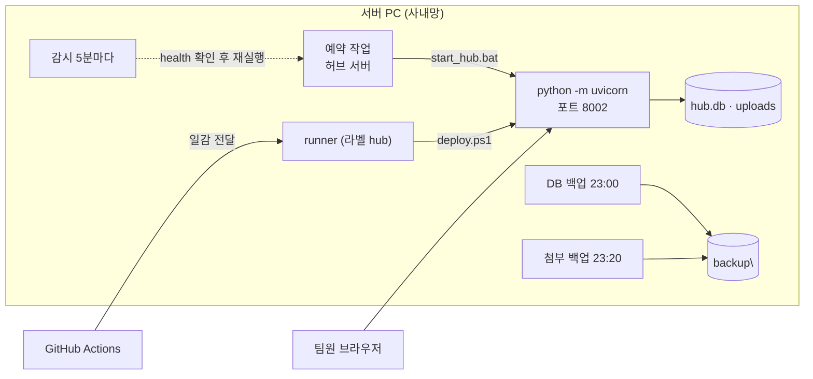

# 서버 PC 운영

사내 서버 PC 한 대에서 허브를 어떻게 띄우고, 죽으면 어떻게 되살리고, 원격에서 어떻게 들여다보는지 정리한 페이지입니다.
"허브가 안 열린다", "배포가 빨간 X 로 끝났다", "데이터를 되돌려야 한다" 같은 상황의 손 순서를 담았습니다.

!!! note "사내 정보는 여기 없습니다"
    접속 주소·로그인 계정 이름·러너 토큰 같은 사내 전용 값은 **사내 인수인계 문서와 USB 패키지 안의 문서**에 있습니다.
    이 페이지는 "무엇이 어디에 있고 어떤 규칙으로 도는지"만 설명합니다.

## 1. 서버 PC 구성

| 항목 | 내용 |
|---|---|
| 서버 PC | 자금팀 사무실의 Windows 11 PC 한 대. 사내망에서만 접속됩니다(http). 주소는 사내 인수인계 문서 참조 |
| 설치 폴더 | `D:\자금팀허브` — `server\`(코드·`hub.db`·`uploads\`), `backup\`, `logs\`, `tools\`(예약 작업 XML·재등록 배치) |
| 파이썬 | `C:\Program Files\Python312\python.exe` (3.12, **전체 사용자용 설치**) |
| 포트·방화벽 | 8002. 인바운드 TCP 8002 허용 규칙 `자금팀 허브 8002` |
| 자동 배포 | GitHub Actions self-hosted runner(라벨 `hub`)가 서비스로 상주. 코드 저장소는 비공개 `SinokorOfficial/finance-team-hub` |
| 데이터 | `server\hub.db`(SQLite 파일 하나) + `server\uploads\`(첨부). 둘 다 git·배포 대상 밖 — **서버 PC에만 있습니다** |

!!! warning "사용자 폴더 안의 파이썬 런처는 쓰지 않습니다"
    파이썬이 사용자 폴더(`AppData`) 안의 런처 형태이면, 예약 작업이 **다른 계정 컨텍스트**로 실행될 때 런처가 자기 런타임을 찾지 못해 서버가 뜨지 않습니다.
    오프라인 설치용 부품(wheels)도 3.12/3.13 전용입니다. "파이썬이 있다"가 아니라 "어디에 있는 파이썬인가"를 확인하세요.

## 2. 예약 작업 4종

서버는 서비스가 아니라 **작업 스케줄러(예약 작업)** 로 돕니다. 4개가 한 세트입니다.

| 작업 이름 | 언제 | 무엇을 | 설정 |
|---|---|---|---|
| `자금팀 허브 서버` | 부팅할 때 | `server\start_hub.bat` → `python -m uvicorn app:app --host 0.0.0.0 --port 8002`, 출력은 `logs\server.log` 로 | 실행 시간 제한 없음(`ExecutionTimeLimit` = `PT0S`), 실패 시 1분 뒤 3회 재시작, 중복 실행 무시 |
| `자금팀 허브 DB 백업` | 매일 23:00 | `server\backup_db.bat` → SQLite **백업 API**로 `backup\hub-YYYYMMDD.db` 생성, 60일 지난 파일 삭제 | 시간을 놓치면 다음 부팅 때 실행 |
| `자금팀 허브 감시` | 5분마다 (부팅 3분 뒤에도) | `server\watchdog.ps1` → `127.0.0.1:8002/api/health` 를 **3번** 확인, 응답이 없으면 포트를 잡고 있는 좀비 프로세스를 정리하고 `자금팀 허브 서버` 를 다시 실행 | 정상일 때는 기록을 남기지 않고, 죽었을 때·되살렸을 때만 `logs\watchdog.log` |
| `자금팀 허브 첨부 백업` | 매일 23:20 | `server\backup_uploads.ps1` → `server\uploads` 를 `backup\uploads` 로 미러 + `backup\uploads-YYYYMMDD.zip`(14일 보관, 합계 200MB 넘으면 zip 생략) | DB 백업은 `hub.db` 만 복사하므로 첨부는 이 작업이 담당 |

감시 작업이 있는 이유는 실제로 겪은 일 때문입니다. 같은 PC의 다른 시스템이 파이썬 프로세스를 일괄 정리하면 허브도 함께 내려갑니다. 감시 작업이 있으면 그런 경우에도 **5분 안에** 스스로 복구됩니다.

**등록 방법** — 서버·DB 백업(①②)은 USB 패키지의 설치 배치가 등록하고, 작업만 다시 등록할 때는 `tools\예약작업_재등록.bat`.
감시·첨부 백업(③④)은 서버 PC에서 `server\tools\작업등록.bat` 을 두 번 클릭합니다(관리자 권한으로 스스로 승격). 안에서 `register_tasks.ps1` 이 **로그인 계정 + LogonType `S4U` + RunLevel `HighestAvailable`** 로 작업 XML을 만들어 `schtasks /create /xml` 로 등록하고, 등록 직후 두 스크립트를 시험 실행해 결과를 보여 줍니다.

!!! warning "배포로는 예약 작업이 등록되지 않습니다"
    배포(robocopy)로 스크립트 **파일 자체는** 갱신되지만, **예약 작업 등록은 `작업등록.bat` 을 사람이 한 번 실행**해야 합니다.
    등록 2분 뒤 `Get-ScheduledTask -TaskName '자금팀 허브*'` 로 4개가 남아 있는지 확인하세요.

### 계정 규칙 — 취향이 아니라 제약입니다

- **SYSTEM 계정으로 등록하지 않습니다.** "SYSTEM + 부팅 트리거 + 배치 파일" 조합은 사내 보안 제품 정책상 **등록 1분 안에 조용히 사라집니다**(작업 스케줄러의 삭제 이벤트조차 남지 않음). 같은 PC에서 살아 있는 다른 시스템의 작업도 전부 로그인 계정 소유입니다.
- **명령을 base64 로 감싸지 않습니다**(`-EncodedCommand`). 내용이 정상이어도 프로세스가 강제 종료됩니다 → 평문 `.bat`·`.ps1` 만 씁니다.
- **S4U** 는 비밀번호를 저장하지 않고도 로그온하지 않은 상태에서 부팅 시 실행되는 방식입니다. 작업 XML은 **UTF-16LE + BOM** 이어야 `schtasks /create /xml` 이 받습니다.

배경은 [ADR-0006 · 서버 PC 예약 작업은 로그인 계정 + S4U](adr/0006-scheduled-tasks-user-s4u.md) 에 있습니다.

## 3. 로그 — 어디를 보면 되는가

| 위치 | 내용 | 읽는 법 |
|---|---|---|
| `logs\server.log` | 서버(uvicorn) 출력. 시작·종료 시각과 파이썬 오류 | **문제가 생기면 여기 마지막 줄부터.** 시작할 때 한 세대만 회전 → 재시작 직전 로그는 `server.prev.log` |
| `logs\deploy.log` | 배포 기록(커밋 앞 7자리 + 단계) | 배포가 실패했을 때 어느 단계였는지 |
| `logs\watchdog.log` | 감시 작업이 **이상을 발견했을 때만** 남기는 기록 | 비어 있거나 없으면 "죽은 적이 없다"는 뜻(정상) |
| `logs\backup_uploads.log` | 첨부 미러 복사·zip 결과 | 매일 한 줄. 파일 개수·용량이 함께 남습니다 |
| `server\VERSION.txt` | 떠 있는 코드의 커밋 앞 7자리 + 반영 시각 | 화면이 최신인지 확인할 때 |
| DB 안 `audit` 표 | 모든 저장·삭제를 누가·언제·무엇에 | [데이터 모델](data-model.md) 참조 |
| DB 안 `history` 표 | 과제별 **바뀐 항목만**(무엇에서 무엇으로) | 화면의 과제 상세 → 「수정 이력」 |

## 4. 원격 진단 — 워크플로우가 유일한 손

서버 PC는 원격 접속(RDP·WinRM·파일 공유)이 막혀 있습니다. 그래서 자리에 가지 않고 상태를 보는 방법은 **GitHub Actions 워크플로우 2종**뿐입니다. 둘 다 **읽기 전용**이고 서버를 건드리지 않습니다.

| 워크플로우 | 보여 주는 것 |
|---|---|
| **서버 진단** (`diag.yml` → `server/diag.ps1`) | 부팅 시각·가동 시간, 포트 리스닝 상태, 파이썬 프로세스, 예약 작업 4종의 상태·계정·마지막 결과·다음 실행, 작업 스케줄러·시스템·업데이트 이벤트, `deploy.log` 꼬리, `server.log`·`server.prev.log` 꼬리 |
| **데이터 점검** (`data-check.yml` → `server/check_data.py`) | `hub.db` 를 **읽기 전용**으로 열어: 계정 상태·권한별 건수와 승인 대기, 담당자 계정 연결/미연결, 필수 항목(사용안내·효과 지표) 충족 현황, 승인 대기 과제, 최근 수정, 수정 이력 건수. **이메일은 가려서 출력합니다** |

실행 방법: 코드 저장소 → **Actions** 탭 → 워크플로우 이름 선택 → **Run workflow**.
1~2분 뒤 잡을 열어 로그를 읽습니다. 진단 로그는 `===== 제목 =====` 으로 구획이 나뉘어 있어 필요한 구획만 보면 됩니다. 핵심만 짚으면:

- 예약 작업 줄의 `State=Ready/Running`, 계정(로그인 계정이어야 함), `Logon=S4U`, `Limit=PT0S`, `LastResult=0x0`
- `없음 (삭제됨?)` 이 보이면 그 작업이 사라진 것 → `작업등록.bat` 또는 `예약작업_재등록.bat`
- 백업 작업의 `LastResult` 가 `0x1` 인 것은 정상일 수 있습니다(지울 오래된 파일이 없을 때 1을 반환)

!!! tip "워크플로우 파일에 한글 경로를 쓰지 마세요"
    워크플로우의 인라인 PowerShell 블록에 한글 경로를 적으면 인코딩이 깨져 실패합니다.
    그래서 설치 폴더를 찾는 일은 워크플로우가 아니라 **스크립트 안**(`check_data.py` 의 `find_db()`, `diag.ps1`·`watchdog.ps1` 의 `$Root` 탐색)에서 합니다.

## 5. 장애 대응 절차

### 허브가 안 열린다

1. **사내망 PC인지** 확인 — 사내망 밖(외부·모바일·VPN 없는 재택)에서는 열리지 않습니다.
2. 서버 PC에 **핑**이 가는지 — 안 가면 PC 전원·네트워크 문제이므로 전산팀.
3. **8002 응답** 확인 — 감시 작업이 정상이면 5분 안에 스스로 되살아나므로, 먼저 5분 기다려 보는 것도 방법입니다.
4. 그래도 안 되면 **Actions → 서버 진단** 실행 → 예약 작업 4개가 남아 있는지 확인. 없으면 `작업등록.bat`·`예약작업_재등록.bat`.
5. 작업은 있는데 서버가 죽어 있으면 `schtasks /run /tn "자금팀 허브 서버"` 로 실행하거나 서버 PC를 재부팅합니다.
6. 그래도 안 뜨면 `server.log` 마지막 줄을 봅니다. 코드 문제면 고쳐서 다시 push 합니다.

!!! warning "start_hub.bat 을 사람이 직접 실행하지 마세요"
    창을 닫을 때 서버도 함께 꺼집니다. 수동으로 켤 때는 **예약 작업**을 실행합니다.

### 배포가 실패했다 (Actions 에 빨간 X)

실패한 잡의 로그에서 `###` 로 시작하는 단계 이름을 찾고(설치 확인 → 서버 중지 → 부품 설치 → 배포 전 검사 → 코드 반영 → 서버 시작), `deploy.log`·`server.log` 를 진단 워크플로우로 확인한 뒤 **고쳐서 다시 push** 합니다. 배포는 push 로만 다시 돕니다.

| 실패 시점 | 서버 상태 | 할 일 |
|---|---|---|
| 코드 반영 **전**(부품 설치·문법 검사·필수 파일 확인) | 스크립트가 **기존 서버를 다시 켜고** 중단 → 팀원은 옛 버전을 계속 씁니다 | 코드를 고쳐 다시 push |
| 코드 반영 **후**(재시작·응답 확인) | 새 코드가 올라간 채 서버가 안 뜬 상태 → **허브가 열리지 않습니다** | `server.log` 를 보고 고쳐 다시 push |
| `예약 작업이 없습니다` | 배포가 시작되지 않음 | 예약 작업을 먼저 등록. 러너가 직접 띄운 서버는 잡이 끝날 때 함께 종료되므로 폴백하지 않습니다 |

러너가 죽어 배포가 아예 걸리지 않을 때의 수동 배포는 [배포](deployment.md) 페이지에 있습니다.

### 계정 잠금 · 비밀번호 초기화

서버 PC를 만질 일이 아니라 **화면에서 하는 일**입니다. 관리자로 로그인 → 계정 관리 탭에서 `[비밀번호 초기화]`(임시 비밀번호가 한 번 표시되고, 그것으로 로그인하면 변경 창이 자동으로 열림)·`[비활성화]`·`[다시 승인]`. 규칙은 [인증](auth.md)·[역할·권한](rbac.md) 참조.

### 데이터를 되돌려야 한다

1. 예약 작업 `자금팀 허브 서버` **중지**
2. `backup\hub-YYYYMMDD.db` 를 `server\hub.db` 자리에 놓기(기존 파일은 이름을 바꿔 남겨 둡니다)
3. 예약 작업 **시작** → 화면에서 데이터 확인. 파일이 온전한지는 SQLite 의 `pragma integrity_check`(`ok` 여야 정상)
4. 첨부파일은 `backup\uploads`(미러) 또는 `backup\uploads-YYYYMMDD.zip` 을 `server\uploads` 로 되돌립니다

!!! danger "hub.db 를 덮어쓰기 전에 한 번 더"
    `hub.db` 는 과제·일정·계정이 **전부 들어 있는 파일 하나**입니다. 덮어쓰면 그 시점 이후의 입력이 사라집니다.
    옛 스냅샷(Artifact판 이관용 JSON)을 다시 넣는 일은 하지 않습니다 — 설치 이후에는 서버판 데이터가 원본입니다.

## 6. 서버 PC 에서 겪은 함정 (재발 방지)

| 함정 | 증상 | 지금의 규칙 |
|---|---|---|
| 예약 작업을 SYSTEM 계정으로 등록 | 등록은 성공한 듯 보이는데 1분 안에 작업이 조용히 사라짐(삭제 이벤트도 없음) | 로그인 계정 + S4U + HighestAvailable 로 XML 등록 |
| 명령을 base64 로 감싼 PowerShell | 내용이 정상이어도 프로세스가 강제 종료됨 | 평문 `.bat`·`.ps1` 만 사용 |
| 작업 스케줄러 기본 "3일 실행 제한" | 서버가 72시간 뒤 이유 없이 종료 | `ExecutionTimeLimit` 없음(`PT0S`) + 실패 시 재시작 3회 |
| `pythonw` 로 서버 실행 | 표준 출력이 없어 uvicorn 이 **기동 직후 종료** | `python.exe` + 로그 파일로 출력 넘기기(S4U 작업은 어차피 창이 안 보임) |
| 사용자 폴더(AppData) 런처 파이썬 | 다른 계정 컨텍스트에서 런타임을 못 찾음, 오프라인 부품 버전 불일치 | `Program Files` 의 전체 사용자용 `python.exe` 만 인정 |
| 워크플로우 인라인 PowerShell 에 한글 경로 | 인코딩이 깨져 실패 | 경로 결정은 스크립트 안에서 |
| git 체크아웃이 줄바꿈을 바꿈 | 설치용 배치가 한글을 못 읽고 깨짐 | `.gitattributes` 로 배치 파일은 변환 금지(cp949 + CRLF 유지). 배치 안 괄호 블록의 `)` 는 이스케이프 |
| `robocopy` 원본 경로 끝의 `\` | 공백 포함 경로에서 복사 실패 | 경로 끝 `\` 제거 |
| 다른 시스템이 파이썬 프로세스를 일괄 종료 | 허브도 같이 내려감 | 감시 작업(5분마다 health 확인 → 재실행) |

## 7. 같은 PC의 다른 시스템과 공존

이 서버 PC에는 다른 팀 시스템 몇 개가 **각자의 포트와 각자의 러너**로 함께 돌고 있습니다.
허브가 쓰는 것은 **포트 8002**, **자기 러너 하나**, **`D:\자금팀허브` 폴더**, **이름이 `자금팀 허브…` 로 시작하는 예약 작업 4개**뿐입니다.

- 다른 시스템의 폴더·예약 작업·러너는 건드리지 않습니다. 서로 독립적으로 배포·재시작되므로 한쪽을 만지면 다른 팀 업무가 멈춥니다.
- **파이썬 프로세스를 이름으로 일괄 종료하지 않습니다.** 같은 PC의 시스템들이 모두 파이썬으로 돕니다. 허브를 멈출 때는 **예약 작업 이름**으로 멈춥니다.
- 포트를 바꾸지 않습니다. 8002 는 방화벽 규칙·감시·배포 스크립트·팀원 안내 주소에 함께 박혀 있습니다.

진단 스크립트는 허브 외의 작업 상태도 함께 출력합니다. 원인을 가릴 때 참고용으로만 보고, 조치는 허브 범위에서만 합니다.

---

**관련 문서**

- [인수인계 체크리스트](handover.md) — 담당자가 바뀔 때 넘길 것과 첫 90분에 할 일
- [배포 (GitHub Actions → 사내 서버 PC)](deployment.md) — push 부터 반영까지의 흐름과 CI 검사
- [ADR-0006 · 서버 PC 예약 작업은 로그인 계정 + S4U](adr/0006-scheduled-tasks-user-s4u.md)
- [ADR-0007 · 첨부파일은 서버 파일시스템에](adr/0007-attachments-on-filesystem.md)
