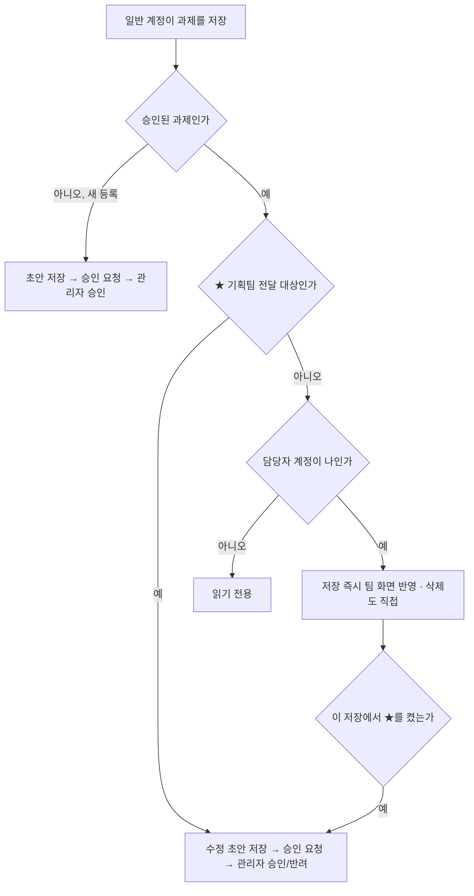

# 역할·권한 (RBAC)

로그인한 사람이 무엇을 할 수 있는지, 어떤 과제는 왜 승인을 받아야 하는지 답하는 페이지입니다.
권한은 역할(3종)과 **담당자 계정 일치 여부**, 그리고 과제가 ★(기획팀 전달 대상)인지로 갈립니다.

## 1. 역할 3종

| 역할 | 저장값 | 볼 수 있음 | 등록 | 수정·삭제 | 승인·계정 관리 |
|---|---|---|---|---|---|
| 관리자 | `admin` | 전부(초안 포함) | 즉시 등록 | 모든 과제를 즉시 수정·삭제 | 가입 승인·거절·비활성, 권한 변경, 비밀번호 초기화, 등록·수정·삭제 요청 승인/반려 |
| 일반 | `member` | 승인된 과제 전부 + 내 초안 | 초안 저장 후 승인 요청 → 관리자 승인 시 게시 | 내가 담당자 계정으로 연결된 과제만(2절) | 없음 |
| 조회 전용 | `viewer` | 승인된 과제 중 **★(그룹 대시보드 등록 대상)만**(1.1절) | 불가 | 불가(상세 창이 읽기 전용) | 없음 |

- 역할은 계정 문서의 `role`이고, 관리자만 바꿀 수 있습니다. **본인 역할은 본인이 바꿀 수 없습니다.**
- 바로가기(`links`)는 예외적으로 승인 절차가 없습니다. 누구나(조회 전용 제외) 추가할 수 있고, 수정·삭제는 관리자 또는 등록한 본인만 할 수 있습니다.
- 일정(`events`)도 승인 절차가 없습니다. 조회 전용이 아니면 등록·수정할 수 있고, 삭제는 관리자 또는 등록한 본인만 가능합니다.

### 1.1 조회 전용 계정에 보이는 범위 (2026-09-10)

조회 전용 계정은 **★(그룹 대시보드 등록 대상, `toPlanning`) 과제만** 볼 수 있습니다.
팀 내부에서만 쓰는 나머지 과제는 목록·메인 화면·상세·이력·엑셀·첨부에서 모두 빠집니다.
바깥(그룹 차원)에 보여 줄 것만 보여 주는 계정이라는 뜻입니다.

판정은 서버 한 곳에 있습니다.

```python
def proj_visible(u, data):          # server/app.py
    if u.get("role") != "viewer": return True
    return bool((data or {}).get("toPlanning"))
```

`can_read_doc()`이 이 판정을 태우기 때문에, 다음이 한꺼번에 걸립니다.

| 지점 | 조회 전용 계정에서 |
|---|---|
| `GET /api/db/projects` | ★ 과제만 내려옵니다 |
| `GET /api/db/projects/{id}` | ★이 아니면 403 |
| `GET /api/stream` | ★이 아닌 과제의 변경은 **삭제로 바꿔** 보냅니다(★를 끄면 그 화면에서 바로 사라짐) |
| `GET /api/history/projects/{id}` | ★이 아니면 403 |
| `GET /api/export/status.xlsx` | ★ 과제만 담기고, **`★ 등록 대상` 열은 파일에서 아예 빠집니다**(빈 열도 남기지 않음, 머리 배너도 "A. 과제 정보") |
| `GET /api/export/group-fill.xlsx` | 403 — 그룹 전달용 양식은 조회 전용에게 내주지 않습니다 |
| `GET /api/files/{fid}`, `POST /api/files/zip` | ★ 과제에 붙은 첨부만. 어느 과제에도 안 붙은 파일도 막습니다 |

화면 쪽은 같은 규칙(`visProj`)으로 한 번 더 걸러 냅니다. 다만 실제 경계는 서버입니다 — 화면을 고쳐도 다른 과제는 내려오지 않습니다.

**걸러진 목록이라는 사실 자체도 드러내지 않습니다(2026-09-11).** 조회 전용 계정은 기획팀 등 바깥 사람이 쓰는 계정이라,
"일부만 보여 준다"는 인상을 주는 요소는 화면에서 모두 뺐습니다 — 조회 전용 사용자에게는 보이는 목록이 그냥 자금팀 과제 전부처럼 읽혀야 합니다.

| 지점 | 조회 전용 계정에서 |
|---|---|
| 통계 줄 | `★`·`승인 대기` 버튼 없음. "N건만 보입니다" 안내도 띄우지 않음 |
| 프로젝트 목록 | `그룹 대시보드` 열(★·등록 메모)을 **열 자체로 그리지 않음** — `body[data-role="viewer"]` 전용 6열 그리드 |
| 상세 창 | A절 제목이 "A · 과제 정보". 기획팀 전달 대상·등록 상태 메모·그룹 과제번호 세 칸(`PLAN_KEYS`)과 작성용 안내문(매뉴얼 문서·개발 문서 안내)은 폼에서 제외. 효과 지표 블록의 "그룹 AX 대시보드와 같은 공식" 문구도 제외 |
| 월 절감 합계 카드 | 안내 문구에서 ★·그룹 AX 언급 제거 |
| 툴바 | `[엑셀 양식]`·`[그룹 양식]` 숨김(`refreshDlBtns()`). `[현황 엑셀]`·`[첨부 내려받기]`는 그대로 |
| 현황 CSV(화면 생성) | `★ 등록 대상`·`그룹 과제번호`·`그룹 등록 메모` 열 제외(`PLAN_EXPORT_KEYS`) |

그대로 두는 것: 상세 창 메타의 **그룹 과제번호**(조회 전용에게 보이는 과제는 전부 등록 대상이라 구분 정보가 새지 않고, 대시보드와 맞춰 보는 참조로 쓸모가 있음)와
목록의 **보완필요** 배지(그룹 대시보드와 같은 용어). 메인 화면의 외부 링크 카드(그룹 AX 대시보드 바로가기 등)는 공개 링크라 그대로 둡니다.
HTML 소스 안의 문구(라벨·시드 데이터 등)까지는 지우지 않습니다 — 화면에 그려지지 않을 뿐, 단일 파일 프런트라 소스 보기에는 남습니다.

## 2. 담당자는 이름이 아니라 계정으로 판정합니다

과제 문서에는 담당자 칸이 두 개 있습니다 — 이름(`owner`)과 계정(`ownerEmail`).
권한 판정은 **`ownerEmail`이 로그인 계정과 같은지**만 봅니다. 이름 매칭은 하지 않습니다(동명이인 때문). → [ADR-0004](adr/0004-owner-by-account-email.md)

```js
const isOwner = p => !!(me && p.ownerEmail &&
  String(p.ownerEmail).toLowerCase() === String(me.email).toLowerCase());
```

`ownerEmail`이 비어 있으면 담당자 본인에게도 수정 버튼이 보이지 않습니다.
관리자는 계정 관리 탭의 **[담당자 계정 연결 실행]** 으로 한 번에 채울 수 있습니다.

| 상황 | 처리 |
|---|---|
| 이름이 승인 계정 1건과 정확히 일치 | 그 계정을 `ownerEmail`에 넣습니다 |
| 같은 이름의 승인 계정이 2건 이상 | 건드리지 않고 '동명이인(직접 지정 필요)'으로 보고 |
| 일치하는 계정이 없음(아직 가입 안 함) | 건드리지 않고 '미가입 담당자'로 보고 |
| `ownerEmail`이 이미 채워져 있음 | 대상에서 제외 |

## 3. ★ 과제와 그 밖의 과제

`toPlanning`(★ 기획팀 전달 대상)이 켜진 과제는 그룹 대시보드에 등록되는 자료이므로 **등록·수정·삭제 모두 관리자 승인**을 거칩니다.
★가 아닌 과제는 담당자가 직접 저장·삭제합니다. → [ADR-0005](adr/0005-approval-only-for-starred.md)

```js
const freeEdit = p => !!(me && !isAdmin() && canEdit() && p &&
  isApproved(p) && !p.toPlanning && isOwner(p));
```



버튼이 상황별로 어떻게 바뀌는지가 곧 이 규칙입니다.

| 과제 상태 | 관리자 | 담당자(일반) | 그 외 일반 계정 |
|---|---|---|---|
| 새로 등록 | `등록`(즉시 반영) · `임시저장` | `초안 저장` · `승인 요청` | 같음 |
| 내 초안(`draft`) | `저장` · `삭제` · 승인/반려 | `초안 저장` · `승인 요청` · `삭제` | 목록에 보이지 않음 |
| 등록 승인 대기(`pending`) | `승인` · `반려` | `승인 요청 취소` | 내용만 열람 |
| 승인된 ★ 과제 | `저장` · `삭제` · `임시저장` | `수정 초안 저장` · `승인 요청` · `삭제 요청` | 읽기 전용 |
| 승인된 ★ 아닌 과제 | 같음 | `저장`(즉시 반영) · `삭제` · `임시저장` | 읽기 전용 |
| 수정 초안이 있는 과제 | 승인/반려 | `수정 초안 저장` · `승인 요청` · `수정 초안 삭제` | 읽기 전용 |
| 수정·삭제 요청 대기 | `승인` · `반려` | `승인 요청 취소` | 읽기 전용 |

- 초안(`draft`)은 작성자와 관리자에게만 보입니다.
- 승인 대기 중에는 요청자도 내용을 고칠 수 없습니다(잠금).
- 수정 요청을 승인하면 `req.data`가 본문에 덮여 쓰이고, 반려하면 요청이 초안 상태로 돌아가며 반려 사유가 요청자 화면에 표시됩니다. 삭제 요청을 승인하면 그 즉시 문서가 지워집니다.
- 담당자가 직접 고치는 과제에 ★를 켜는 순간, 그 저장은 승인 요청으로 전환됩니다.

## 4. 서버가 다시 검사하는 것

화면은 버튼을 숨기는 것뿐입니다. 실제 판정은 `server/app.py`의 `check_write()`·`owner_free()`가 저장·삭제 요청마다 다시 합니다.

| 검사 | 어길 때 |
|---|---|
| 조회 전용(`viewer`)은 어떤 저장도 못 함 | 403 "조회 전용 계정은 저장할 수 없습니다" |
| `accounts`·`meta` 컬렉션은 관리자만 변경 | 403 "관리자만 바꿀 수 있습니다" |
| 계정 문서에 비밀번호 칸(`pwSalt`·`pwHash`)을 직접 넣을 수 없음 | 403 "비밀번호는 전용 절차로만 바꿀 수 있습니다" |
| 본인 계정의 `role`을 본인이 바꿀 수 없음 | 403 "본인 권한은 바꿀 수 없습니다" |
| 일반 계정은 `approval`을 `approved`로 만들 수 없음(담당자 직접 저장 제외) | 403 "승인은 관리자만 할 수 있습니다" |
| 일반 계정이 과제를 통째로 덮어쓰기(`PUT`)할 때 `approval`도 없고 담당자 직접 저장도 아니면 거부 | 403 "승인 절차 없이 저장할 수 없습니다" |
| 삭제는 관리자, 본인이 만든 초안·승인 대기 문서, 또는 담당자 직접 과제(`owner_free`)만 | 403 "삭제는 관리자만 할 수 있습니다(본인 초안·담당자 과제 제외)" |
| 첨부 올리기는 조회 전용 불가, 첨부 삭제는 올린 사람·관리자만 | 403 |

`owner_free()`가 참이 되는 조건은 네 가지가 모두 맞을 때입니다.

1. 문서가 있고,
2. `approval`이 비어 있거나 `approved`이며,
3. ★(`toPlanning`)가 아니고 대기 중인 요청(`req`)도 없고,
4. `ownerEmail`이 로그인 계정과 같음.

읽기도 걸러집니다. `accounts` 컬렉션은 관리자와 본인만 전체(비밀번호 칸 제외)를 보고, 다른 사람의 계정은
승인된 계정에 한해 `email`·`name`·`role`·`status`·`company`만 보입니다(담당자 계정 선택용).
실시간 알림(`/api/stream`)도 계정 변경분을 같은 기준으로 가공해서 내려보냅니다.

## 5. 필수 항목 규칙 (v3.20~v3.21)

필수 항목을 언제 검사하는지가 저장 종류마다 다릅니다. 기준은 하나입니다 — **저장이 곧 팀 화면 반영인가.**

| 저장 종류 | 필수 항목 검사 |
|---|---|
| 관리자 저장 | 전부 검사 |
| 담당자 직접 저장(★ 아닌 과제) | 전부 검사 |
| 승인 요청 | 전부 검사 |
| 초안 저장 · 수정 초안 저장 | 과제명만 |
| 임시저장 | 과제명만. 버튼은 관리자와 담당자 직접 저장 과제에만 나옵니다 |

- 임시저장으로 비워 둔 필수 항목이 있으면 목록에 **'보완필요'** 표시가 붙습니다.
- 관리자가 승인할 때 필수 항목이 비어 있으면 무엇이 비었는지 알려 주고, 그래도 승인할지 다시 묻습니다.

필수 항목 자체의 규칙은 두 가지 예외가 있습니다.

| 항목 | 규칙 |
|---|---|
| 사용안내 요약(`manual`) | 개발 상태가 `운영중`인 과제만 필수입니다. 만들기 전 단계에는 쓸 내용이 없기 때문입니다 → [ADR-0009](adr/0009-manual-required-when-live.md) |
| 매뉴얼 문서 첨부(`files`) | 개발 상태가 `운영중`인 과제만 필수입니다. 그룹 대시보드는 자료를 파일·주소로만 받고 글로 적는 칸이 없어, 대시보드에 올릴 문서가 따로 필요합니다 → [ADR-0011](adr/0011-manual-document-attachment.md) |
| 효과 지표 | 개발 상태와 무관하게 전 상태 필수. **시간 절감(절감 시간) 또는 비용 절감(금액) 중 한 세트**가 채워지면 통과합니다 |

효과 지표는 한 세트가 서로 짝을 맞춰야 합니다. 절감 시간을 적었으면 주기를 골라야 하고,
주기가 `회당`이면 빈도까지 골라야 합니다. 비용 절감도 같은 방식이며 주기 `건당`일 때 빈도가 필요합니다. → [효과 지표](savings.md)

---

## 관련 문서

- [인증 (로그인·가입·승인)](auth.md) — 계정이 만들어지는 과정
- [API](api.md) — 각 경로에 필요한 권한
- [기능 카탈로그](features.md) — 승인 워크플로우가 화면에서 어떻게 보이는지
- [ADR-0005 · ★ 과제는 승인 절차, 그 외는 담당자 직접 수정](adr/0005-approval-only-for-starred.md)
